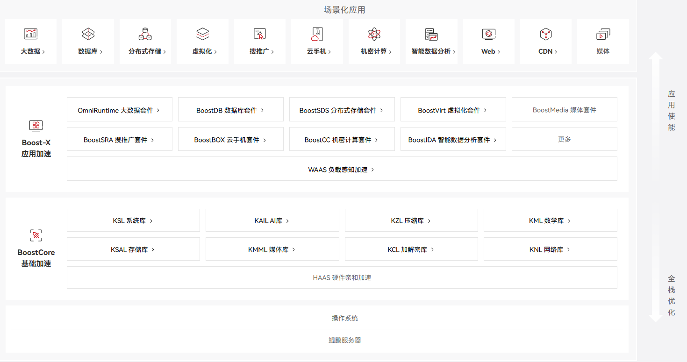
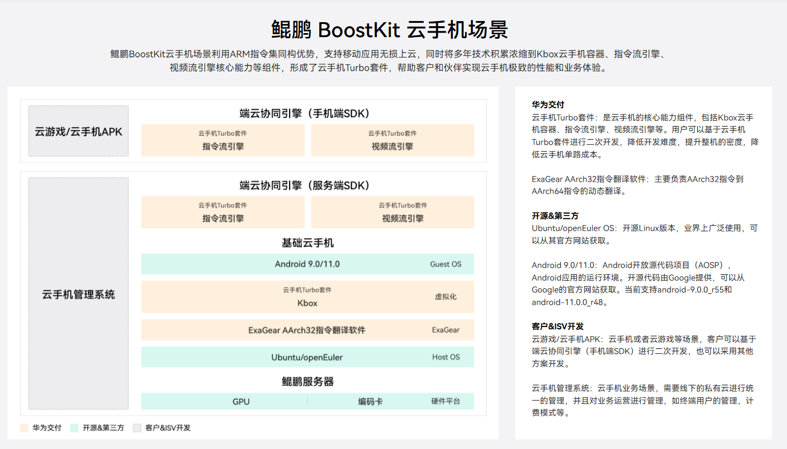
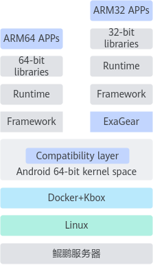

# Chapter1. Boostkit

## 一、定位

| **核心定位** | 鲲鹏应用使能套件，通过软硬协同优化释放鲲鹏算力 |
| ------------ | ---------------------------------------------- |
| **核心目标** | 使能应用极致性能，让开发者"用好鲲鹏"           |

## 二、云手机

### Ⅰ x86 arm框架

| 维度           | x86 (英特尔, AMD)                    | ARM (安谋)                                     | RISC-V (开源)                                      |
| :------------- | :----------------------------------- | :--------------------------------------------- | :------------------------------------------------- |
| **核心哲学**   | **性能至上** 复杂指令集              | **能效平衡** 精简指令集                        | **极简与开放** 精简指令集                          |
| **指令集类型** | CISC                                 | RISC                                           | RISC                                               |
| **商业模式**   | **封闭授权** 仅由英特尔、AMD设计     | **灵活授权** 可授权IP核或架构许可              | **完全开源** 可自由使用、修改                      |
| **主要市场**   | 服务器、桌面PC、高性能笔记本         | **移动设备**、嵌入式、物联网、新兴的服务器与PC | 物联网、嵌入式、新兴的定制化芯片（AI、专用加速器） |
| **关键优势**   | 单核性能强、生态成熟、软件兼容性极佳 | **高能效比**、低成本、高度可定制化             | **设计自由**、无授权费、模块化、后发技术优势       |

### Ⅱ ExaGear AArch32指令翻译软件

**价值优势**

1. 基于鲲鹏服务器，在云手机场景下能够完全100%兼容AArch32的应用。 

2. 支持pre-translator特性，优化翻译后的APP启动时间，提升客户体验。

**关键技术**

1. 对Android APP整个应用进行AArch32到AArch64指令的转换。 

2. 支持pre-translator特性，提升APP启动速度。

| 名称                                 | 说明                                                         |
| ------------------------------------ | ------------------------------------------------------------ |
| ARM64 APPs                           | 64位的Android应用。                                          |
| ARM32 APPs                           | 32位的Android应用。                                          |
| 64-bit libraries，Runtime，Framework | 64位运行库和运行环境。                                       |
| 32-bit libraries，Runtime，Framework | 32位运行库和运行环境。                                       |
| Compatibility layer                  | API映射，负责完成32位API向64位API的映射。                    |
| ExaGear                              | 动态二进制翻译程序，对ARM32用户态应用进行AArch32指令到AArch64指令的动态翻译。 |
| Android 64-bit kernel space          | Android内核。                                                |
| Docker+Kbox                          | Kbox容器方案，基于容器化的Android虚拟化方案。                |