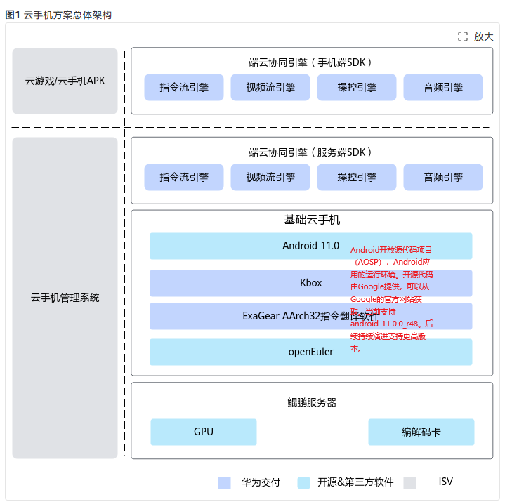

# Chapter1. Boostkit

## 一、定位

| **核心定位** | 鲲鹏应用使能套件，通过软硬协同优化释放鲲鹏算力 |
| ------------ | ---------------------------------------------- |
| **核心目标** | 使能应用极致性能，让开发者"用好鲲鹏"           |

## 二、云手机

### Ⅰ五套件介绍

云手机Turbo套件是云手机的核心能力组件，包括Kbox云手机容器、指令流引擎、视频流引擎、操控引擎、音频引擎等。客户或者ISV可以基于云手机Turbo套件进行二次开发，降低开发难度，提升整机的密度，降低云手机单路成本。

1. Kbox：Kbox鲲鹏高密云手机容器方案，性能领先行业方案100%，深度兼容**OpenGL ES 3.x/Vulkan 1.1**等接口，完美兼容**AOSP** 。
2. 视频流引擎：云手机配套视频流引擎，提供物理终端和云手机基于**H.264/H.265**等视频格式进行界面交互，可支持客户构建泛终端（**终端只需视频解码能力**）可用的通用云手机服务。
3. 指令流引擎：云手机配套指令流引擎，提供物理终端和云手机基于GPU指令重定向功能的界面交互，支持客户构建超高画质（**1080P/2K/4K**）、超低时延（较视频方案时延低20ms+）的高级云手机服务。
4. 操控引擎：云手机配套操控引擎，提供物理终端上的操控事件重定向到云手机服务端，并在云手机应用进程中响应操控事件，实现操控功能。
5. 音频引擎：云手机配套音频引擎，获取云手机中音频数据重定向物理终端进行声音播放，实现音视频同步、无损音质等功能。

> OpenGL ES 3.X：3D图形应用程序接口（API）标准。你可以把它理解为一套强大的工具包。
>
> 
>
> DEQP（drawElements质量计划）是用于GPU测试的开源测试套件，主要用于验证图形驱动与API（如OpenGL、Vulkan等）的兼容性和功能完整性。
>
> 
>
> | 特性              | H.264（AVC）                       | H.265（HEVC）                                                |
> | :---------------- | :--------------------------------- | :----------------------------------------------------------- |
> | **压缩效率**      | **基准**（在同等画质下，文件更大） | **高约 50%**（在同等画质下，文件大小约为 H.264 的一半）      |
> | **视频质量**      | 良好                               | **更优**（在同等码率下，画面更清晰，细节保留更好，色块感更少） |
> | **带宽/存储占用** | 较高                               | **较低**，节省带宽和存储空间                                 |
> | **适用分辨率**    | 主要用于 1080p（全高清）           | 主要为 **4K/8K（超高清）** 设计                              |
> | **编码复杂度**    | 较低                               | **非常高**，编码和解码需要更强的计算能力                     |
> | **硬件支持**      | **极其广泛**，几乎所有设备都支持   | **日益普及**，但一些老旧设备不支持硬解，需要软件解码（对CPU负担大） |
> | **专利费用**      | 明确且相对简单                     | 复杂，存在多个专利池，曾影响其推广                           |
>
> **追求最大兼容性时，选择 H.264**
>
> **追求高效率和高画质时，选择 H.265**

### Ⅱ x86 arm框架

| 维度           | x86 (英特尔, AMD)                    | ARM (安谋)                                     | RISC-V (开源)                                      |
| :------------- | :----------------------------------- | :--------------------------------------------- | :------------------------------------------------- |
| **核心哲学**   | **性能至上** 复杂指令集              | **能效平衡** 精简指令集                        | **极简与开放** 精简指令集                          |
| **指令集类型** | CISC                                 | RISC                                           | RISC                                               |
| **商业模式**   | **封闭授权** 仅由英特尔、AMD设计     | **灵活授权** 可授权IP核或架构许可              | **完全开源** 可自由使用、修改                      |
| **主要市场**   | 服务器、桌面PC、高性能笔记本         | **移动设备**、嵌入式、物联网、新兴的服务器与PC | 物联网、嵌入式、新兴的定制化芯片（AI、专用加速器） |
| **关键优势**   | 单核性能强、生态成熟、软件兼容性极佳 | **高能效比**、低成本、高度可定制化             | **设计自由**、无授权费、模块化、后发技术优势       |

### Ⅲ ExaGear AArch32指令翻译软件

**价值优势**

1. 基于鲲鹏服务器，在云手机场景下能够完全100%兼容AArch32的应用。 

2. 支持pre-translator特性，优化翻译后的APP启动时间，提升客户体验。

**关键技术**

1. 对Android APP整个应用进行AArch32到AArch64指令的转换。 

2. 支持pre-translator特性，提升APP启动速度。

| 名称                                 | 说明                                                         |
| ------------------------------------ | ------------------------------------------------------------ |
| ARM64 APPs                           | 64位的Android应用。                                          |
| ARM32 APPs                           | 32位的Android应用。                                          |
| 64-bit libraries，Runtime，Framework | 64位运行库和运行环境。                                       |
| 32-bit libraries，Runtime，Framework | 32位运行库和运行环境。                                       |
| Compatibility layer                  | API映射，负责完成32位API向64位API的映射。                    |
| ExaGear                              | 动态二进制翻译程序，对ARM32用户态应用进行AArch32指令到AArch64指令的动态翻译。 |
| Android 64-bit kernel space          | Android内核。                                                |
| Docker+Kbox                          | Kbox容器方案，基于容器化的Android虚拟化方案。                |

# Chapter2. 迭代

## 202403

- 发布特性：Kbox云手机容器、视频流引擎
- 新增功能：视频流云手机支持分辨率自适应和架构解耦

## 202406

- Kbox云手机容器：支持Android系统属性可定制、支持进程异常退出后进程重启恢复正常
- 视频流引擎：支持设置视频相关参数、提供传感器和GPS直通功能、支持WebRTC流化传输、基于Containerd运行云手机，并实现K8s集群管理、基于国产化GPU协同实现渲染流化一体方案

## 202412

- Kbox云手机容器：vulkan支持的ASTC纹理、支持纹理压缩、Gralloc模块支持YCbCr_420_888格式、支持自适应帧同步、支持摄像头仿真数据配置
- 视频流引擎：支持动态设置编码分辨率

## 202503

- Kbox云手机容器：实现Android轻量化裁剪、支持动态帧率调整、提供GPU显存、内存等资源监控能力
- 视频流引擎：支持动态帧率调整、提供GPU显存、内存等资源监控能力

## 202506

- Kbox云手机容器：新增内存超分特性
- 视频流引擎：支持360P/480P分辨率；实现Android composer优化；实现K8s NUMA亲和绑定；支持虚拟机和容器下部署视频流云手机

## 202509

- Kbox云手机容器：自适应帧同步特性优化效果泛化、支持线程级Shader Cache
- 视频流引擎：新增适配4K分辨率

# Chapter 3. 友商方案业务痛点

x86模拟器方案：基于x86服务器以及模拟器软件构建的云手机方案

- 需要在x86指令集和ARM指令集之间转换，效率低，最少有40%的性能损失。
- x86的复杂指令到ARM的精简指令并非一对一转换，存在应用兼容性问题，难以彻底解决。

手机开发板方案（简称AP板方案）：采用手机开发板定制的服务器，由手机自带的Android系统构建的云手机方案

- 不能获得高于单一手机芯片的性能，难以满足高性能场景应用。
- 基于消费类电子电路进行设计，难以满足公有云的服务可靠性及大规模集群管理需求。
- 无法实现云手机性能动态扩展和灵活调度。

# Chapter 4. 硬件信息

| 服务器类型 | 处理器型号          | BIOS版本 | CPLD版本 | BMC版本    |
| ---------- | ------------------- | -------- | -------- | ---------- |
| 鲲鹏服务器 | 鲲鹏920 7260处理器  | 6.56     | 5.09     | 5.96       |
| 鲲鹏服务器 | 鲲鹏920 7280Z处理器 | 20.55    | 5.08     | 5.05.12.15 |

| 项目         | BIOS                                     | CPLD                           | BMC                                               |
| :----------- | :--------------------------------------- | :----------------------------- | :------------------------------------------------ |
| **核心职能** | **启动和初始化**                         | **硬件逻辑控制**               | **远程带外管理**                                  |
| **运行状态** | 开机时运行，引导完操作系统后任务基本完成 | 上电即持续运行                 | **只要通电就7x24小时运行**，与主系统无关          |
| **依赖关系** | 依赖CPLD保证正确的电源时序等             | 是一个独立的硬件逻辑单元       | 是一个独立的“小电脑”，会调用BMC芯片内部的CPLD逻辑 |
| **更新频率** | 相对较高（支持新CPU等）                  | 很低（除非有重大硬件逻辑缺陷） | 中等（修复漏洞、增加功能）                        |
| **用户接触** | 普通PC用户也可能需要设置                 | 几乎只有硬件工程师关心         | 服务器管理员和运维人员经常使用                    |

以服务器开机为例：

1. 插上电源，**BMC** 和 **CPLD** 首先获得电力，开始工作。BMC等待远程指令，CPLD准备好硬件环境。
2. 当你（本地或通过BMC远程）按下开机键时，**CPLD** 执行精确的电源时序，给各个部件上电。
3. 上电完成后，**BIOS** 开始运行，进行硬件自检和初始化。
4. **BIOS** 引导操作系统启动。
5. 在整个过程中，**BMC** 一直在背后监控着所有硬件的健康状况，并将信息报告给管理员。

---

| 配置项     | 典型配置（鲲鹏服务器）              |                           | 说明                                                         |
| ---------- | ----------------------------------- | ------------------------- | ------------------------------------------------------------ |
| 服务器类型 | 2U双路机架均衡型，8*2.5英寸硬盘机箱 |                           | 根据客户对机柜空间、磁盘大小、密度、PCIe 网卡数量等的需求选择合适的服务器类型。机架服务器：最灵活，支持各类硬盘类型，预留多个PCIe槽位，支持GPU卡。 |
| CPU        | 2*华为鲲鹏920 7260/7265F处理器      | 2*华为鲲鹏920 7280Z处理器 | CPU配置根据客户的业务规格和配置可以动态调整，提供更多的计算资源。 |
| 内存插槽   | 16*32GB                             | 16*64GB                   | 内存配置根据客户的业务规格和配置可以动态调整。               |
| 系统盘     | 2*480GB固态硬盘SATA                 | 2*480GB固态硬盘SATA       | 系统盘配置根据客户的业务规格和配置可以动态调整。             |
| 数据盘     | 1*V6 固态硬盘-1920GB SATA           | 2*固态硬盘-3840GB SATA    | 数据盘配置根据客户的业务规格和配置可以动态调整。             |
| GPU        | 2~4*GPU                             | 4~10GPU                   | 需要配置GPU，客户可自行采购GPU和下载GPU驱动，华为提供移植编译指导书，具体支持的GPU品牌和型号，项目交付时咨询项目接口人。 |
| 编解码卡   | 1*NETINT Quadra T2A（可选）         | 不涉及                    | 具体编解码卡品牌和型号，项目交付时咨询项目接口人。           |
| RAID控制卡 | 1*9440-8i                           | 1*9440-8i                 | 可以根据实际需要选择配置。                                   |
| Riser卡    | 2*(x16+x8)                          | 2*(x16+x8)                | 与GPU具体型号相关，可以根据实际需要选择配置。                |

# Chapter 5.病毒扫描结果

| 防病毒软件名称          | 防病毒软件版本 | 病毒库版本            | 扫描时间            | 扫描结果 |
| ----------------------- | -------------- | --------------------- | ------------------- | -------- |
| QiAnXin**奇安信**       | 8.0.5.5260     | 2025-06-27 08:00:00.0 | 2025-06-28 17:37:20 | OK       |
| Bitdefender**比特梵德** | 7.0.3.2038     | 7.99075               | 2025-06-28 17:37:27 | OK       |
| Kaspersky**卡巴斯基**   | 12.0.0.6672    | 2025-06-27 02:05:00   | 2025-06-28 17:37:17 | OK       |

# Chapter 6. 特性清单

[特性清单.xlsx](./assets/特性清单.xlsx)

