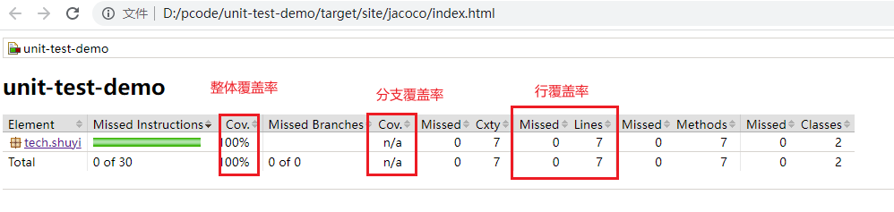

# Chapter 0. 代码覆盖率

[使用 G Cox 和 LCOV 度量 C/C++项目的代码覆盖率](./assets/使用 Gcov 和 LCOV 度量 CC++ 项目的代码覆盖率.md)

代码覆盖率是一种评估软件测试质量的方法，它可以反映测试用例是否能够覆盖程序的所有代码。代码覆盖率越高，说明测试用例越全面，软件质量越高。代码覆盖率有不同的计算方式和指标，例如语句覆盖率、判定覆盖率、条件覆盖率等。不同的编程语言和测试框架也有相应的代码覆盖率工具和标准。

# Chapter 1. JaCoCo

JaCoCo 是一个免费的 Java 代码覆盖率库，它可以生成可读的代码覆盖率报告。

`jacoco-sessions. html` 是一个用于展示 JaCoCo 收集的代码覆盖率数据的 HTML 文件。它可以显示每个测试用例的执行情况，包括执行次数，执行时间，覆盖率百分比，以及覆盖率对应的源代码行数。它还可以显示每个类或方法的总覆盖率和平均覆盖率，以及每个分支或循环的覆盖率和复杂度。
`index. html` 是 JaCoCo 生成的代码覆盖率报告的主要入口文件当你打开这个文件时，你会看到一个可视化的报告，展示代码的覆盖率信息。这个报告包括了各种详细的统计数据，例如：

- 每个包、类、方法的覆盖率
- 执行的指令数量
- 分支覆盖率
- 复杂度等

[超详细！手把手教你用 JaCoCo 生成单测覆盖率报告！](./assets/超详细！手把手教你用 JaCoCo 生成单测覆盖率报告！.md)

- **Element**：表示被测试的元素，可以是包、类、方法或代码行。
- **Missed instructions**：表示未被执行的字节码指令数量。JaCoCo计算的最小单位就是字节码指令。指今覆盖率表明了在所有的指今中，哪些被执行过以及些没有被执行；
- **Cov.**：表示覆盖率，即被执行的代码占总代码的比例；
- **Missed Branches**：表示未被执行的代码分支数量。例如，如果一个 if 语句的 true 分支被执行了，但 false 分支没有被执行，那么就有一个 missed branch ；
- **Missed Cxty**：表示未被覆盖的圈复杂度。圈复杂度是一种代码复杂度的度量，对于每个方法 if， for , while , switch 等都会增加圈复杂度；
- **Missed Lines**：表示未被执行的代码行数量；
- **Missed Methods**：表示未被执行的方法数量；
- **Missed Classes**：表示未被执行的类数量。

# Chapter 2. LCOV

lcov 是一个用于生成代码覆盖率报告的工具，它可以帮助你检测你的代码有多少被测试过，哪些代码被测试不足。lcov 是基于 gcc 的 gcov工具的图形化前端，它可以将 gcov 生成的 gcda 和 gcno 文件转换为 html 格式，方便查看和分析。lcov 的使用方法大致如下：

- 在编译和链接你的代码时,需要加上 `-fprofle-arcs` 和 `-ftest-coverage` 两个选项，这样可以让 gcc 在编译时插入一些代码来记录行数、函数调用和分支情况。
- 运行你的测试程序时,会产生一些 `.gcda` 文件，每个源文件对应一个 `.gcda` 文件。这些文件包含了程序执行过程中每一行代码被执行了多少次的信息。
- 使用 lcov 命令来捕捕获这些数据,并生成一个基准数据文件 (coverage.info)，用于比较不同版本或不同测试用例下的覆盖率变化。
- 使用 genhtml 命令来将基准数据文件转换为 html 格式，并生成一个覆盖率报告 (coverage. html)，用于展示每个源文件、函数和分支的覆盖率情况。

---

test_detail 和 coverage_result 是 lcov 生成的覆盖率报告的目录，它们的区别是：

- test_detail 目录是 lcov 生成的基准数据文件，用于比较不同版本或不同测试用例下的覆盖率变化，基准数据文件包含了每个源文件、函数和分支的代码覆盖率情况，以及一些统计信息，如行数、函数数、分支数等。基准数据文件可以用 lcov 命令来生成，也可以用其他工具来合并或过滤。
- coverage_result 目录是 lcov 生成的覆盖率报告目录，里面包含了不同格式的覆盖率报告，例如 html , png , txt 等。覆盖率报告可以帮助你查看每个源文件、函数和分支的代码覆盖率情况，从而评估测试的充分性和质量。覆盖率报告可以用浏览器打开查看，也可以用其他工具来转换或导出。

---

- `index.html`：这是默认的覆盖率报告视图，它按照源文件的目录结构显示每个源文件，函教和分支的覆盖率情况。
- `index-sort-b.html`：这是按照分支覆盖率排序的覆盖率报告视图。分支覆盖率是指在测试过程中，每一个判断的分支是否都被测试到。通过这个视图，你可以快速找到覆盖率较低的分支，从而优化你的测试用例。==Branches==
- `index-sort-f.html`：这是按照函数覆盖率排序的覆盖率报告视图。函数覆盖率是指在测试过程中，每一个函数被调用的次数占总函数数的比例。通过这个视图，你可以快速找到覆盖率较低的函数，从而优化你的测试用例。==Functions==
- `index-sort-l.html`：这是按照行覆盖率排序的覆盖率报告视图。行覆需率是指在测试过程中，每一行代码被执行的次数占总行数的比例。通过这个视图，你可以快速找到覆盖率较低的代码行，从而优化你的测试用例。==Lines==