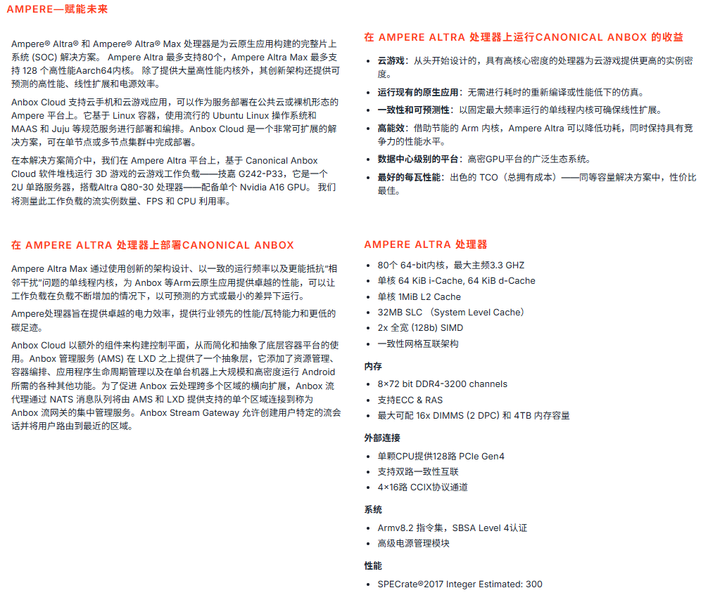
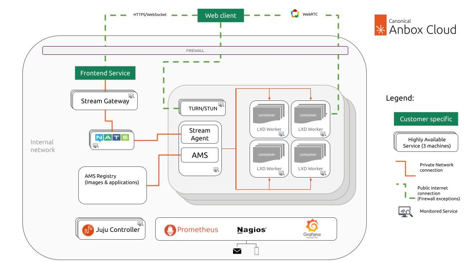
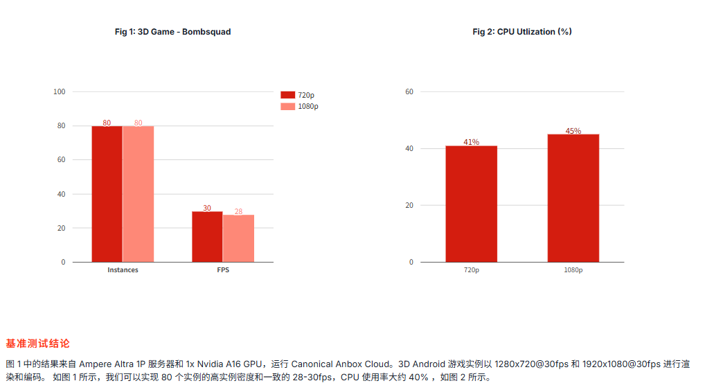

# 可能的问题：

## 1. 测试和开发区别

开发：某个或某几个技术领域比较深入地去钻研，可能技术面不会铺的很管，但会比较深

测试：接触的面比较广

例子：

Arm 原生的开发 会在 Kbox 或 指令流 或 视频流 或 GPU 渲染 等某个领域去深入，

但是

测试需要对整个解决方案都要了解，深度不深，但是基本东西需要掌握。再就是测试的话和其他各领域的交流沟通比较多，包括 SE（系统工程师） 、开发 、QA （质量保障工程师）、POC 、资料等，事情会稍微比开发琐碎，需要细致仔细

## 2. 版本测试要注意哪些事情

质量和效率。

如何在保障质量的前提下提升效率是要持续去深入思考和探索的。

质量这里要抓住测试重点，保障重点模块或场景的测试充分，对于可信以及健康迭代等方面坚守底线、严格要求，守住测试在质量要求的底线。

效率的话就是在面对硬件组合比较多、版本交叠冲突的情况下，如何制定出合理的策略提升测试效率，另外就是保障自动化率以及 CI 日构建的上线率，使用自动化代替人力提升效率。

## 3. 版本测试，在哪些方面加强或改进？后面打算怎么开展工作？

2 号 的时候开发组织了媒体组业务宣讲会，会上基本明确了测试组归属到那边后的具体工作内容。

主要可以分解为当前一直在做的版本测试工作，以及当前开发那边在做的硬件测试验证部分。

首先版本测试这块，我打算基本延续现在的模式以及人员安排，但是会考虑测试的重点，有些不重要的部分适当减少测试用例，重点保障 poc 测试场景部分的质量。

关于硬件测试，我理解就是要对我们打算引入的各种 GPU 以及编码卡还有服务器进行性能摸底测试。为了实现这一目标，我计划结合我输出的测试套来指定一套硬件兼容性以及性能测试的标准。之前会议上开会团队也提到他们在进行硬件测试时遇到很多困难，希望可以在我们来之后有专业的团队来更高效地完成。另外我们还计划鱼硬件兼容团队深入交流，将我们的测试场景及用例引入到他们的测试中，以便提前并解决潜在问题。

## 4. Arm 原生的竞争力在哪里？性价比怎么样？瓶颈在哪？

竞争力：整机密度。整机密度高了，单路价格自然会降低，性价比也会提升。

当前我们在路数这块是基本与 AP 持平的，但是当前互联网客户大多数已经引入了 AP 的机器，如何在这种背景下打开我们的市场，展现出我们的实力，那可能持平还与那远不够，可能组要更高的路数，所以路数提升是关键。

瓶颈：据我了解和分析，之前在 7260 机型上，瓶颈主要在 cpu 。 gpu 的资源都是过剩的。在 920B 机型上，对 cpu有了一个比较大的提升，瓶颈可能会落到 gpu 或编码卡上，关于这块的瓶颈分析，后面我也会和开发进行深入的交流和分析

## 5. poc 测试的重点是什么

性价比和竞争力，

在技术和业务层面达成甚至超出客户的预期，展现我们的专业实力。

版本测试 转测相关需求 利用测试
硬件适配专项 根据改变的gpu和编码卡 拉取对应的测试用例

# 竞品分析

https://m.pedaily.cn/99discoveries/28738

## Canonical Anbox 方案简介

处理器：Ampere Altra 和 Ampere Altra Max 处理器。Ampere Altra 最多支持80个，Ampere Altra Max 最多支持 128 个高性能Aarch64内核。 

### 基准测试配置信息

Anbox Cloud 使我们能够大规模运行 Android 应用程序的自动化测试。流式传输的基准需要更多的自动化，而不仅仅是启动容器。因此，Anbox Cloud 提供了专门的基准测试工具。 该工具自动执行以下任务：

- 创建流式会话
- 接收视频/音频流
- 收集各种统计数据
- 可选项：将接收到的流转储到本地文件

基准测试工具是通过 anbox-cloud-testssnap 提供的，可以使用以下命令安装：

snap install anbox-cloud-tests

要运行基准测试，我们必须为 Anbox Stream Gateway 提供身份验证令牌，结果以文本形式打印出来。 或者，我们可以使用 --format=json 将输出格式更改为 JSON，并使用 --report-path=/path/to/report.json 选项将结果保存到文件中。

用以下命令针对 Anbox Cloud 运行基准测试： anbox-cloud-tests.benchmark \ --screen-width=1280 \ --screen-height=720 \ --screen-fps=30 \ --stream-dump-path=/path/to/stream/dump/output \ --application=my-application \ --url=<https:// URL of the Anbox Stream Gateway> \ --auth-token= \

