# Chapter 1.认识软件测试

## Ⅰ什么是软件测试

- 概念：使用技术手段验证软件是否满足需求。

- 目的：用最少的人力、物力、财力，找到软件中的问题并修复，从而降低商业风险。


## Ⅱ常见测试分类

- 功能测试：对软件的功能进行测试。
- 自动化测试：使用**代码**或**工具**代替人工验证项目功能

- 接口测试：针对模块与模块或系统与系统之间数据请求地址进行测试
- 性能测试：模逆多人使用软件，查找服务器缺陷

> IT 常见岗位及作用：
>
> 1. 前端：写⻚⾯ 
> 2. 后端：后端服务程序
> 3. 测试：找缺陷
> 4. UI： 设计图（美⼯）
> 5. 运维：管理服务器（安装软件项⽬的电脑）
> 6. 产品：梳理需求、设计原型图 
> 7. 运营：上线运营策划。


### 一、按测试阶段划分

1. 单元测试：针对程序源代码进行测试（一般为开发自测）。
2. 集成测试：又称接口测试，针对模块之间访问地址进行测试。
3. 系统测试：队整个系统进行测试包括功能、兼容、文档等测试。
4. 验收测试：主要分为内测、公测，使用不同人群来发掘项目缺陷。


### 二、按代码可见度划分

1. 黑盒测试：看不见源代码，主要对程序功能进行测试
2. 灰盒测试：看见部分代码，主要对程序接口进行测试
3. 白盒测试：看见全部代码，主要对程序源代码进行测试


### 三、拓展--总结

- 系统测试和黑河测试重点核心是**功能测试**
- 集成测试和会和测试又称**接口测试**
- 单元测试和白盒测试是对**代码**进行测试
- 自动化测试归属**功能测试**
- 性能测试、安全测试归属于**专项测试**


### 四、拓展--测试策略

冒烟测试：大规模执行测试之前，针对程序主功能进行验证，保证程序具备可测性。

面试题：提测标准是什么？--冒烟测试通过！

面试题：测试之前要做什么？--冒烟测试


## Ⅲ 模型

### 一、质量模型--针对任何软件或硬件，测试要覆盖的方面


- **功能**性：功能满足需求
- **性能**效率：性能满足实际需求
- **兼容**性：软件能与主流硬件和软件兼容
- **易用**性：便于使用
- **可靠**性：性能和功能应用可靠
- 信息**安全**：信息在传输或者存储过程的安全程度
- 可维护性：便于维护
- 可移植性：具备迁移和便携性


### 二、测试模型--W 模型


> 深蓝为开发流程；绿色为测试流程；

优点：

1. 测试伴随整个产品开发周期，测试对象不仅是程序还有需求、设计文档。
2. 测试介入较早，尽早发现问题，降低修复成本。


## Ⅳ 测试流程


1. 开发SE发布相关文档，阅读后进行 `开发SE\MDE 测试TSE进行需求分析会` ，确定各部门对需求理解一直。站在不同角度对需求进行查漏补缺（性能参数、机型配置、需求描述不清晰等等）。
2. TSE 组织测试进行测试用例设计。明确测试目标和测试安排以及测试人员。
3. TSE 组织测试内部用例评审。
4. TSE 拉开发组织用例评审。
5. 执行测试用例执行。
6. 测试报告：测试目标、测试过程、缺陷统计、缺陷分析、测试总结。


## Ⅴ 测试用例

- **什么是用例**：用例即用户案例，为测试项目而设计的执行文档。

- 考虑点：质量模型（功能、性能、兼容、易用、安全）

- 测试用例的作用：
  - 防止漏测

  - 实施测试的标准

- 执行用例

- 设计用例：不同的场景和需求，有不同的用例设计方法，需要学习用例的设计方法


- 用例设计编写格式（八大要素）
  - 用例编号
  - 用例标题
  - 模块/项目：所属项目或模块
  - 前置条件：执行此条用例前有哪些前置操作
  - 优先级：P0~P4（P0最高）
  - 测试步骤
  - 测试数据
  - 预期结果

# Chapter 2. 用例设计

## Ⅰ等价类划分法--解决穷举问题

### 一、说明 | 分类 | 步骤

- 说明：在所有测试数据中，具有某种共同特征的数据集合进行划分

- 分类
  - 有效等价类：满足需求的数据集合
  - 无效等价类：不满足需求的数据集合
- 步骤
  1. 明确需求
  2. 确定有效和无效等价类
     - 有效等价：所有有效数据集合，取一个即可
     - 无效等价：所有无效数据集合，取一个即可
  3. 提取数据编写测试用例


### 二、案例

#### 2-1 需求：验证 QQ 账号的合法性 

要求：6-10 位自然数

1. 明确需求：6-10位自然数
2. 确定有效和无效等价类
   - 有效（6、7、8、9、10）：8位自然数
   - 无效（小于6位、大于10位）：4位自然数、8位非自然数
3. 提取数据编写用例
   - 12345678
   - 1234
   - 1234567a


#### 2-2 需求：验证某城市电话号码的正确性

要求：

1. 区号：空或者是三位数字
2. 前缀码：非 ”0“ 且非 ”1“ 开头的三位数字
3. 后缀码：4 位数字

案例：

1. 确认需求

   

2. 确定有效和无效等价类

   

3. 提取数据编写用例

   


### 三、适用场景

针对：需要有大量数据测试输入，但是没法穷举测试的地方

- 输入框
- 下拉列表
- 单选复选框

典型代表：页面级的输入框类测试


## Ⅱ 边界值分析法--解决边界限制问题

### 一、边界范围的节点


### 二、边界值法设计用例步骤

1. 明确需求
2. 确定有效和无效等价类
3. 确定边界范围
4. 提取数据编写测试用例


### 三、离点优化

**离点**采用：开内闭外

例子：

`6<=qq<=10` -> 5、11


### 四、适用场景

1. 在等价类的基础上针对有边界范围的测试数据输入的地方（重点关注边界）
2. 常见词语描述：大小、尺寸、重量、最大、最小、至多、至少等修饰词语
3. 典型代表：有边界范围的输入框类测试


## Ⅲ 判定表法--解决多条件依赖问题

### 一、判定表法的引入

案例：验证“若用户欠费或关机，则不允许主被叫” 功能的测试。

说明：

1. 等价类边界值分析法主要关注单个输入类条件的测试。
2. 并未考虑输入条件之间的各种组合、输入条件与输出结果之间有相互制约关系的测试。


### 二、判定表定义及组成部分

- 定义：是一种以表格形式表达多条件逻辑判断的工具

- 组成：

  - 条件桩：列出问题中的所有条件，列出条件的次序无关紧要。
  - 动作桩：列出问题中可能采取的操作，操作的排列顺序没有约束。
  - 条件项：列出条件对应的取值，所有可能情况下的真假值。
  - 动作项：列出条件项的、各种取值情况下应该采取的动作结果。

  

- 规则：

  - 判定表中贯穿条件项和动作项的一列就是一条规则
  - 假设有 n 个条件 每个条件有 2 个取值，劝阻和有`2^n` 种规则


### 三、判定表设计用例步骤

1. 明确需求
2. 画出判定表
   - 列出条件桩和动作桩
   - 填写条件项，对条件进行全组合
   - 根据条件项的组合确定动作项
   - 简化、合并相似规则（有相同的动作）
3. 根据规则编写测试用例


### 四、示例

#### 4-1 订购单检查

规则：

1. 如果金额大于 500 元，又未过期，则发出批准单和提货单；
2. 如果金额大于 500 元，但过期了，则不发批准单与提货单；
3. 如果金额小于等于 500 元，则不论是否过期都发出批准单和提货单；
4. 在过期的情况下不论金额大小还需要发出通知单。

---

步骤 1：确定条件和条件取值

- 条件 1：**金额**，取值为 `>500元`、`≤500元`
- 条件 2：**是否过期**，取值为 `未过期`、`过期`

步骤 2：确定动作

- 动作 1：发出**批准单**
- 动作 2：发出**提货单**
- 动作 3：发出**通知单**

步骤 3：构建判定表


步骤 4：提取测试用例

| 测试用例编号 | 金额   | 是否过期 | 预期结果：批准单 | 预期结果：提货单 | 预期结果：通知单 |
| ------------ | ------ | -------- | ---------------- | ---------------- | ---------------- |
| TC1          | 600 元 | 未过期   | 发出             | 发出             | 不发出           |
| TC2          | 600 元 | 过期     | 不发出           | 不发出           | 发出             |
| TC3          | 500 元 | 未过期   | 发出             | 发出             | 不发出           |
| TC4          | 300 元 | 过期     | 发出             | 发出             | 发出             |


#### 4-2 文件修改规则

规则：

1. 输入的第一列字符必须是 A 或 B

2.  第二列字符必须是一个数字

3. 如果第一列字符不正确，则给出信息 L

4. 如果第二列字符不正确，则给出信息 M

5. 如果两列字符输入正确，则修改文件成功

---

步骤 1：确定条件和条件取值

- 条件 1

  ：第一列字符是否为 A 或 B。

  - 取值：是（用 `Y` 表示），否（用 `N` 表示）

- 条件 2

  ：第二列字符是否为数字。

  - 取值：是（用 `Y` 表示），否（用 `N` 表示）

步骤 2：确定动作

- **动作 1**：给出信息 `L`（第一列不正确）。
- **动作 2**：给出信息 `M`（第二列不正确）。
- **动作 3**：修改文件成功。

步骤 3：构建判定表

我们列出所有可能的条件组合，并根据规则确定每个组合对应的动作。

| 规则编号   | 条件 1 (第一列是 A/B) | 条件 2 (第二列是数字) | 动作 1 (输出 L) | 动作 2 (输出 M) | 动作 3 (修改成功) |
| ---------- | --------------------- | --------------------- | --------------- | --------------- | ----------------- |
| **规则 1** | Y                     | Y                     |                 |                 | √                 |
| **规则 2** | Y                     | N                     |                 | √               |                   |
| **规则 3** | N                     | Y                     | √               |                 |                   |
| **规则 4** | N                     | N                     | √               | √               |                   |

**注**：`√` 表示该动作会被执行。

步骤 4：提取测试用例

根据判定表中的每一条规则，我们可以设计出一个对应的测试用例。

| 测试用例编号 | 输入 (第一列，第二列) | 预期输出 / 结果                                  |
| ------------ | --------------------- | ------------------------------------------------ |
| **TC1**      | (A, 1)                | 修改文件成功                                     |
| **TC2**      | (B, 5)                | 修改文件成功 (与 TC1 等价，可作为备选或回归用例) |
| **TC3**      | (A, X)                | 给出信息 M                                       |
| **TC4**      | (B, ?)                | 给出信息 M (与 TC3 等价，可作为备选或回归用例)   |
| **TC5**      | (C, 3)                | 给出信息 L                                       |
| **TC6**      | (1, 8)                | 给出信息 L (与 TC5 等价，可作为备选或回归用例)   |
| **TC7**      | (Z, Y)                | 给出信息 L 和 给出信息 M                         |

优化说明：

- **等价类划分**：在上述测试用例中，`TC1` 和 `TC2` 都属于 “条件全满足” 的等价类，选择其中一个即可覆盖规则 1。同样，`TC3` 和 `TC4`、`TC5` 和 `TC6` 也属于同一等价类。
- **最小用例集**：为了覆盖所有 4 条规则，我们只需要选择 `TC1`, `TC3`, `TC5`, `TC7` 这四个测试用例即可。这是最精简、最高效的测试用例集。


### 五、使用场景

- 有多个输入条件，多个输出结果，输入条件之间有**组合**关系，输入条件和输出结果之间有依赖（制约）关系。
- 判定表一般适用于条件组合数较少的情况（比如 4 个条件以下）

> 提示：如果碰到项目中多条件组合大于 4 个相互依赖，可以使用正交表和因果图


## Ⅳ 场景法（流程图法）

### 一、介绍

基于流程图梳理业务。

> 扩展：错误推荐法
>
> 场景：时间紧、任务量大时使用


### 二、案例

#### 2-1 ATM 机取款流程

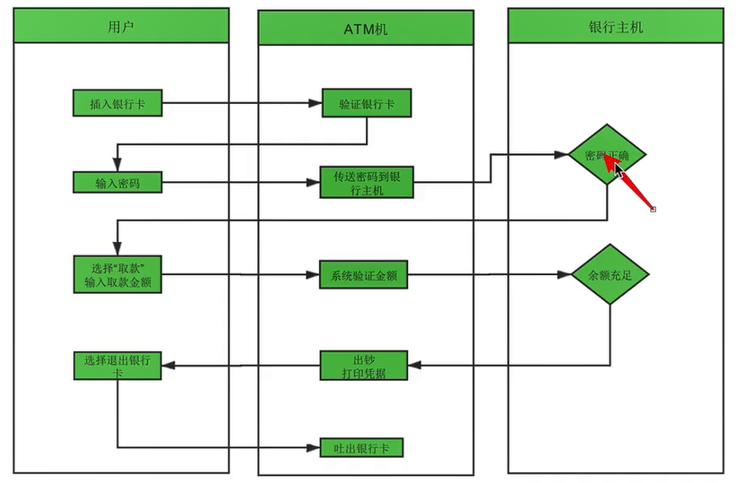


# Chapter 3. 缺陷

## Ⅰ 缺陷介绍

### 一、缺陷定义

软件在使用过程中存在的任何**问题**都叫软件的缺陷，简称**bug**


### 二、缺陷判定标准

1. 少功能 
2. 功能实现错误 
3. 多功能(客户没要求 但是做了)
4. 隐性功能错误 
5. 不易使⽤


### 三、缺陷产生原因

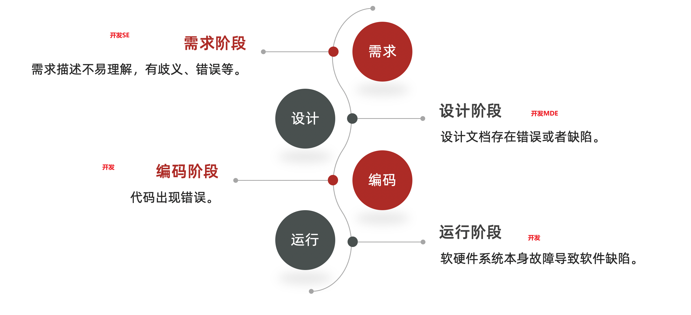

### 四、缺陷的生命周期

注入bug 发现bug 清除bug

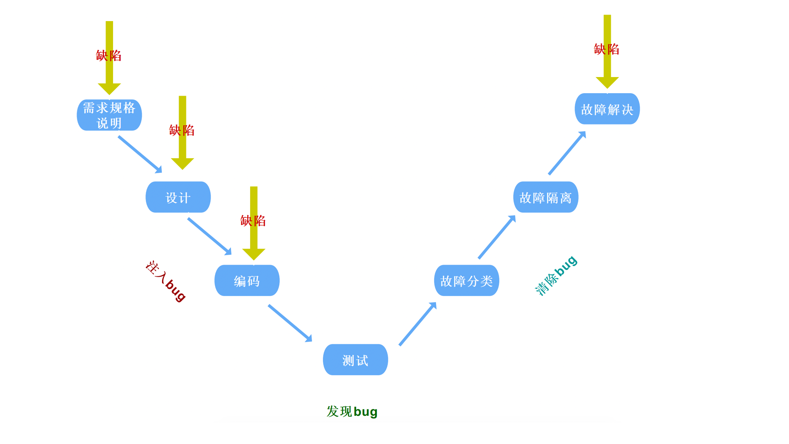


### 五、提单内容

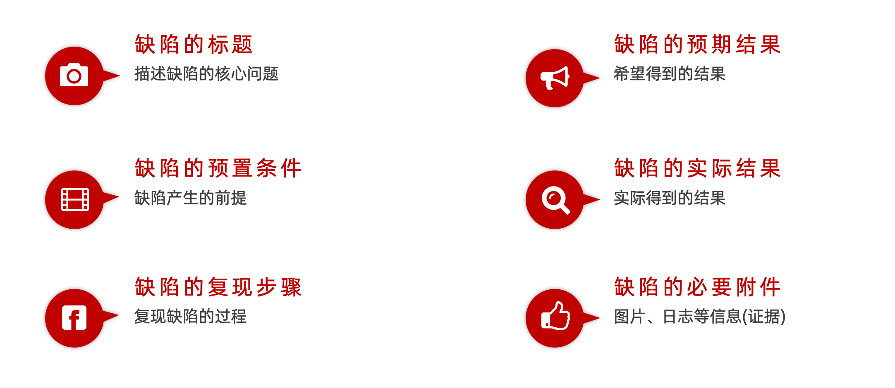


### 六、提单要素

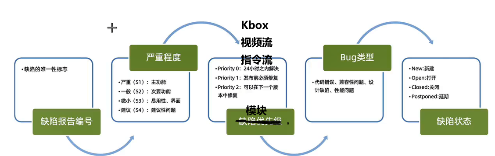


### 七、缺陷类型

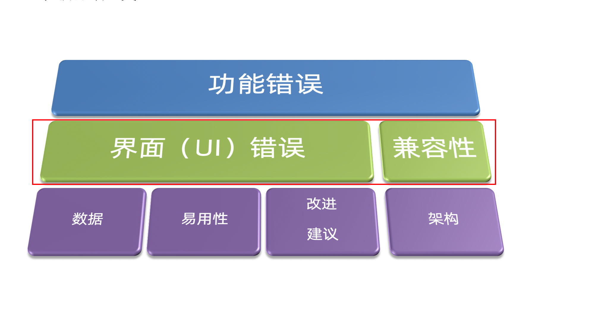

> 面试题：
>
> 1. 如果是界⾯或兼容性的错误为前端bug 
> 2. 如果是功能错误区分前端和后端bug,需要**抓包**查看请求和响应


## Ⅱ 缺陷编写

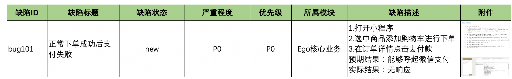

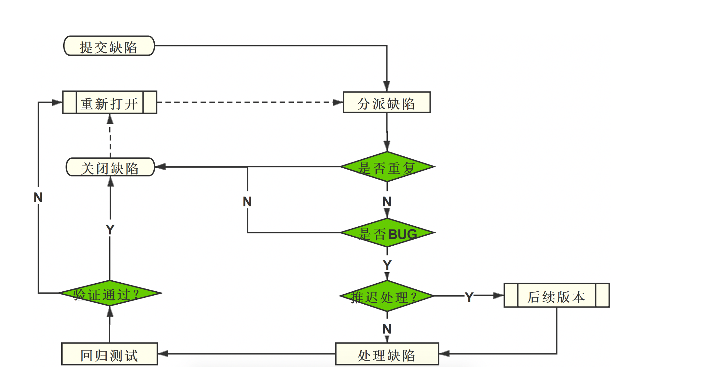

>  ⾯试题：发现bug后，⾸先会怎么办？--确认bug可复现。


## Ⅲ 缺陷管理工具--提单工具

### 一、禅道的介绍

- 禅道、`jira`
- https://www.zentao.net/

提单系统 华为DTS系统缺陷管理平台


### 二、提交bug

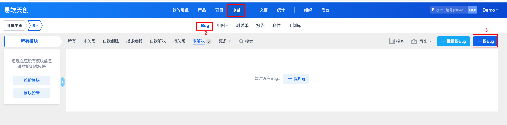

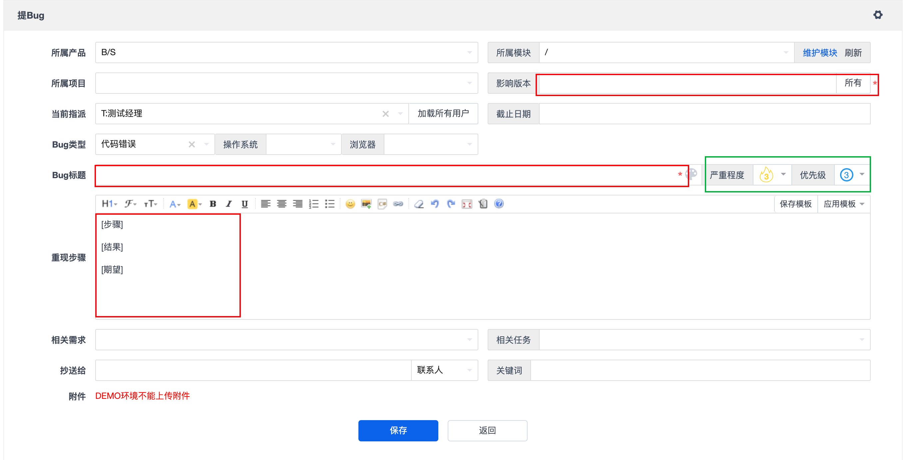

### 三、用例管理

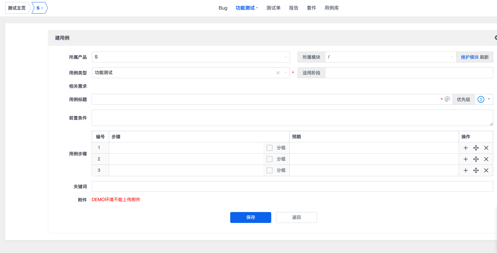


# Chapter 4. html

## Ⅰ、html介绍

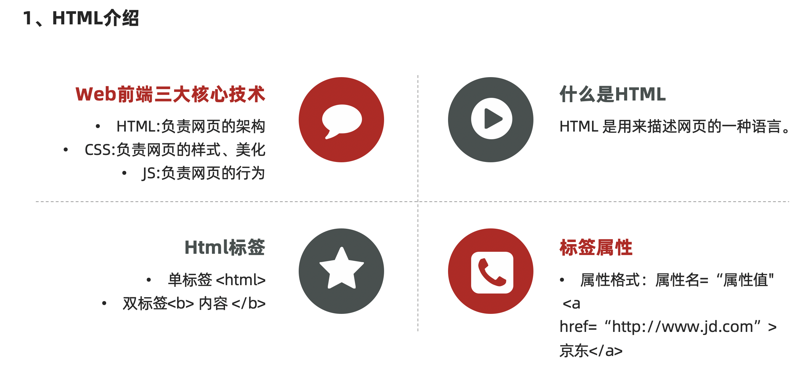


## Ⅱ、骨架标签

```html
<!DOCTYPE html>
<html>
<head>
    <meta charset="UTF-8">
    <title>标题</title>
</head>
<body>
	内容
</body>
</html>
```


## Ⅲ、常用标签

### 一、注释标签

```html
<!-- 
	ctrl + / 注释
	拓展测试点：前端页面注释，上线前必须检查并删除
	换行
	空格
-->
<br />
&nbsp;
```


### 二、标题标签

```html
<h1>h1</h1>
<h2>h2</h2>
<h3>h3</h3>
<h4>h4</h4>
<h5>h5</h5>
<h6>h6</h6>
```


### 三、段落标签

```html
<p>这是一个段落标签</p>
```


### 四、超链接标签

- **作用**：点击文本跳转到指定页面。 
- **属性**： 
  -  `href`：指定点击文本后跳转的链接地址
  - `target`：当值为`_blank`时，点击链接会在新窗口中打开页面。
- **示例代码**： 

```html
<a href="http://www.baidu.com" target="_blank">点我去百度</a>
```


### 五、图片标签

- **作用**：在页面中插入图片。
- **属性**：
  - `src`：加载图片的路径，用于指定图片文件的位置。
  - `width`：设置图片的宽度。
  - `height`：设置图片的高度。
  - `alt`：图片未加载时显示的替代信息，提升可访问性。
  - `title`：图片加载后鼠标悬停时显示的提示信息；若图片未加载，也会显示（优先级低于`alt`）。

```html

```


### 六、路径

- 相对路径
  - `./`：同级目录
  - `../`：上级目录
- 绝对路径


### 七、布局标签

- `div` 是块级元素，独占一行，用于分割页面区域

- `span` 是行内元素，不独占一行，用于包裹小段文本或行内元素。

```html
<div>
	<div>div1</div>
	<div>div2</div>
	<div><span>div3</span></div>
</div>
```

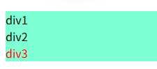

### 八、input 标签

`<input>` 标签用于在 HTML 表单中创建交互式控件，让用户输入数据。

标签最重要的属性，它决定了输入控件的类型和外观。常见值包括：

- `text`：单行文本框（默认）。
- `password`：密码框，输入内容会被隐藏。
- `checkbox`：复选框。
- `radio`：单选按钮。
- `submit`：提交按钮，用于提交表单。
- `reset`：重置按钮，用于重置表单内容。
- `button`：普通按钮，通常配合 JavaScript 使用。
- `file`：文件选择框，用于上传文件。

1. **`name` 属性**：为输入控件命名。当表单提交时，`name` 和 `value` 会作为键值对发送到服务器。
2. **`value` 属性**：设置或获取输入控件的值。

```HTML
<!-- 文本输入框 -->
<input type="text" name="username" placeholder="请输入用户名">
<br />
<!-- 密码输入框 -->
<input type="password" name="password" placeholder="请输入密码">
<br />
<!-- 复选框 -->
<input type="checkbox" name="remember" value="1" checked> 记住我
<br />
<!-- 单选按钮组 -->
<input type="radio" name="gender" value="male" checked> 男
<input type="radio" name="gender" value="female"> 女
<br />
<!-- 提交和重置按钮 -->
<input type="submit" value="登录">
<input type="reset" value="重置">
```


### 九、form 标签

`<form>` 标签用于创建一个 HTML 表单，用于**收集用户输入**并将其**提交到服务器**进行处理。

**核心特性**：

1. **容器角色**：`<form>` 是一个块级元素，它作为所有表单控件（如 `<input>`、`<textarea>`、`<select>` 等）的容器。

2. **`action` 属性**：指定表单数据提交到的服务器端程序的 URL 地址。

3. `method` 属性

   ：定义提交表单数据的 HTTP 方法，主要有两种：

   - `get`：默认方法。表单数据会附加在 URL 后面发送，可见于地址栏。适用于查询等操作。
   - `post`：表单数据会放在请求体（Request Body）中发送，不可见于地址栏。适用于提交敏感信息或大量数据。

4. **`name` 属性**：为表单命名（在 JavaScript 中可能用到）。

**工作流程**：

1. 用户在 `<form>` 内部的控件中输入或选择数据。
2. 用户点击提交按钮（通常是 `<input type="submit">`）。
3. 浏览器将表单内所有带有 `name` 属性的控件的数据收集起来，组成一个键值对集合。
4. 浏览器根据 `method` 属性指定的方法，将这些数据发送到 `action` 属性指定的 URL。
5. 服务器端程序接收并处理这些数据。

```html
<form action="/login" method="post">
    <label for="username">用户名:</label>
    <input type="text" id="username" name="username" required>
    <br>
    <label for="password">密码:</label>
    <input type="password" id="password" name="password" required>
    <br>
    <input type="submit" value="登录">
</form>
```


### 十、列表标签

无序列表

```html
<ul>
  <li>苹果</li>
  <li>香蕉</li>
  <li>橙子</li>
</ul>
```

有序列表

```html
<ol>
  <li>第一步</li>
  <li>第二步</li>
  <li>第三步</li>
</ol>
```


# Chapter 5. 项目实战

## Ⅰ需求

```
登录需求-1
1. 输入正确的中国手机号（11位）
    - 当文本框失去焦点的时候验证，红色为失败，绿色为成功
2. 点击发送验证码
    - 如果手机号文本框状态为绿色，弹出“点击按钮进行验证”；
    - 如果手机号文本框为红色，提示手机号不正确
3. 点击按钮进行验证
    - 拖拽图形到指定位置，按钮消失；
    - 拖拽图形未到指定位置，晃动提醒，滑块回到初始位置；
    - 超过5次，提示尝试过多，请点击重试；

登录需求-2
1. 输入验证码
    - 正确的验证码，并“勾选我已阅读并同意”，点击登录，进入系统；
    - 错误的验证码，并“勾选我已阅读并同意”，点击登录，提示验证码错误；
    - 正确的验证码，未“勾选我已阅读并同意”，点击登录，提示请勾选；
2. 点击登录
    - 手机号、验证码都为绿色，勾选“我已阅读并同意”，登录成功

发布文章板块
1. 文章标题不能小于5个字符
2. 文章内容不能为空
3. 频道不能为空
4. 封面选择：
    - 单图
    - 三图
    - 无图
    - 自动
5. 点击选择图片
    - 素材库、上传图片切换
    - 素材库
        - 全部和收藏切换
        - 图片可以选择
    - 上传图片
        - 点击选择图片-选择本地文件
        - 点击开始上传-如果已经选择本地文件，点击上传，上传成功
        - 点击开始上传-如果未选择本地文件，提示“请选择一张图片”
6. 点击发表，提示新增文章成功，跳转到内容列表，文章状态显示待审核
7. 点击存入草稿，提示新增文章成功，跳转到内容列表，文章状态显示草稿
```


## Ⅱ 测试点

[点击查看本地文本文件](./assets/01.认识测试-项目实战.xmind)

