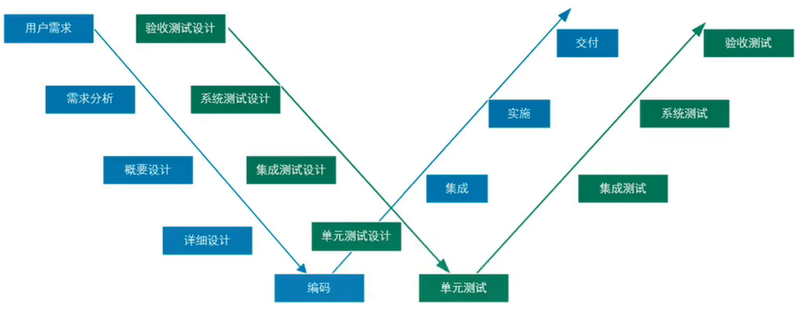
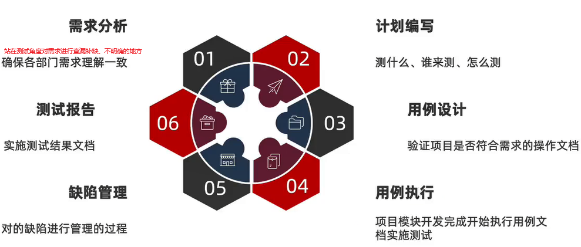
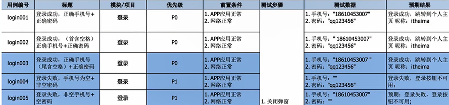
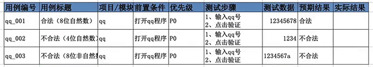
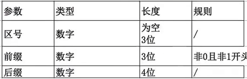
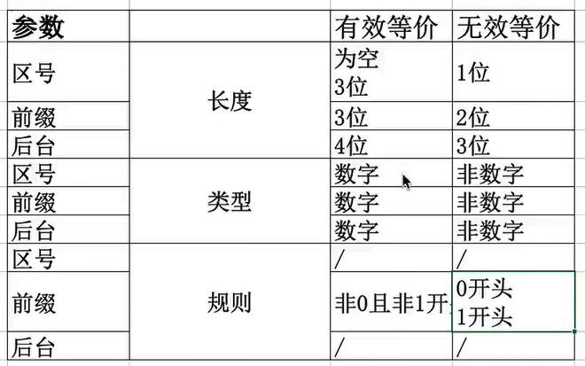
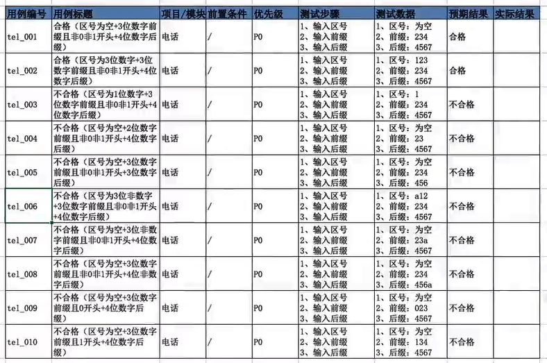
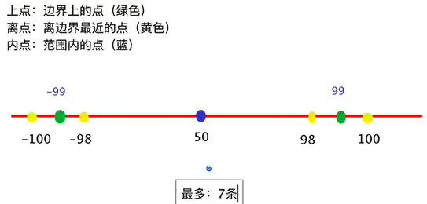
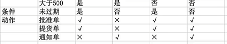

# Chapter 1.认识软件测试

## Ⅰ什么是软件测试

- 概念：使用技术手段验证软件是否满足需求。

- 目的：用最少的人力、物力、财力，找到软件中的问题并修复，从而降低商业风险。

## Ⅱ常见测试分类

- 功能测试：对软件的功能进行测试。
- 自动化测试：使用**代码**或**工具**代替人工验证项目功能

- 接口测试：针对模块与模块或系统与系统之间数据请求地址进行测试
- 性能测试：模逆多人使用软件，查找服务器缺陷

### 一、按测试阶段划分

1. 单元测试：针对程序源代码进行测试（一般为开发自测）。
2. 集成测试：又称接口测试，针对模块之间访问地址进行测试。
3. 系统测试：队整个系统进行测试包括功能、兼容、文档等测试。
4. 验收测试：主要分为内测、公测，使用不同人群来发掘项目缺陷。

### 二、按代码可见度划分

1. 黑盒测试：看不见源代码，主要对程序功能进行测试
2. 灰盒测试：看见部分代码，主要对程序接口进行测试
3. 白盒测试：看见全部代码，主要对程序源代码进行测试

### 三、拓展--总结

- 系统测试和黑河测试重点核心是**功能测试**
- 集成测试和会和测试又称**接口测试**
- 单元测试和白盒测试是对**代码**进行测试
- 自动化测试归属**功能测试**
- 性能测试、安全测试归属于**专项测试**

### 四、拓展--测试策略

冒烟测试：大规模执行测试之前，针对程序主功能进行验证，保证程序具备可测性。

面试题：提测标准是什么？--冒烟测试通过！

面试题：测试之前要做什么？--冒烟测试

## Ⅲ 模型

### 一、质量模型--针对任何软件或硬件，测试要覆盖的方面

- **功能**性：功能满足需求
- **性能**效率：性能满足实际需求
- **兼容**性：软件能与主流硬件和软件兼容
- **易用**性：便于使用
- **可靠**性：性能和功能应用可靠
- 信息**安全**：信息在传输或者存储过程的安全程度
- 可维护性：便于维护
- 可移植性：具备迁移和便携性

### 二、测试模型--W 模型

> 深蓝为开发流程；绿色为测试流程；

优点：

1. 测试伴随整个产品开发周期，测试对象不仅是程序还有需求、设计文档。
2. 测试介入较早，尽早发现问题，降低修复成本。

## Ⅳ 测试流程

1. 开发SE发布相关文档，阅读后进行 `开发SE\MDE 测试TSE进行需求分析会` ，确定各部门对需求理解一直。站在不同角度对需求进行查漏补缺（性能参数、机型配置、需求描述不清晰等等）。
2. TSE 组织测试进行测试用例设计。明确测试目标和测试安排以及测试人员。
3. TSE 组织测试内部用例评审。
4. TSE 拉开发组织用例评审。
5. 执行测试用例执行。
6. 测试报告：测试目标、测试过程、缺陷统计、缺陷分析、测试总结。

## Ⅴ 测试用例

- **什么是用例**：用例即用户案例，为测试项目而设计的执行文档。

- 考虑点：质量模型（功能、性能、兼容、易用、安全）

- 测试用例的作用：
  - 防止漏测

  - 实施测试的标准

- 执行用例

- 设计用例：不同的场景和需求，有不同的用例设计方法，需要学习用例的设计方法

- 用例设计编写格式（八大要素）
  - 用例编号
  - 用例标题
  - 模块/项目：所属项目或模块
  - 前置条件：执行此条用例前有哪些前置操作
  - 优先级：P0~P4（P0最高）
  - 测试步骤
  - 测试数据
  - 预期结果

# Chapter 2. 用例设计

## Ⅰ等价类划分法--解决穷举问题

### 一、说明 | 分类 | 步骤

- 说明：在所有测试数据中，具有某种共同特征的数据集合进行划分

- 分类
  - 有效等价类：满足需求的数据集合
  - 无效等价类：不满足需求的数据集合
- 步骤
  1. 明确需求
  2. 确定有效和无效等价类
     - 有效等价：所有有效数据集合，取一个即可
     - 无效等价：所有无效数据集合，取一个即可
  3. 提取数据编写测试用例

### 二、案例

#### 2-1 需求：验证 QQ 账号的合法性 

要求：6-10 位自然数

1. 明确需求：6-10位自然数
2. 确定有效和无效等价类
   - 有效（6、7、8、9、10）：8位自然数
   - 无效（小于6位、大于10位）：4位自然数、8位非自然数
3. 提取数据编写用例
   - 12345678
   - 1234
   - 1234567a

#### 2-2 需求：验证某城市电话号码的正确性

要求：

1. 区号：空或者是三位数字
2. 前缀码：非 ”0“ 且非 ”1“ 开头的三位数字
3. 后缀码：4 位数字

案例：

1. 确认需求

   

2. 确定有效和无效等价类

   

3. 提取数据编写用例

   

### 三、适用场景

针对：需要有大量数据测试输入，但是没法穷举测试的地方

- 输入框
- 下拉列表
- 单选复选框

典型代表：页面级的输入框类测试

## Ⅱ 边界值分析法--解决边界限制问题

### 一、边界范围的节点

### 二、边界值法设计用例步骤

1. 明确需求
2. 确定有效和无效等价类
3. 确定边界范围
4. 提取数据编写测试用例

### 三、离点优化

**离点**采用：开内闭外

例子：

`6<=qq<=10` -> 5、11

### 四、适用场景

1. 在等价类的基础上针对有边界范围的测试数据输入的地方（重点关注边界）
2. 常见词语描述：大小、尺寸、重量、最大、最小、至多、至少等修饰词语
3. 典型代表：有边界范围的输入框类测试

## Ⅲ 判定表法--解决多条件依赖问题

### 一、判定表法的引入

案例：验证“若用户欠费或关机，则不允许主被叫” 功能的测试。

说明：

1. 等价类边界值分析法主要关注单个输入类条件的测试。
2. 并未考虑输入条件之间的各种组合、输入条件与输出结果之间有相互制约关系的测试。

### 二、判定表定义及组成部分

- 定义：是一种以表格形式表达多条件逻辑判断的工具

- 组成：

  - 条件桩：列出问题中的所有条件，列出条件的次序无关紧要。
  - 动作桩：列出问题中可能采取的操作，操作的排列顺序没有约束。
  - 条件项：列出条件对应的取值，所有可能情况下的真假值。
  - 动作项：列出条件项的、各种取值情况下应该采取的动作结果。

  

- 规则：

  - 判定表中贯穿条件项和动作项的一列就是一条规则
  - 假设有 n 个条件 每个条件有 2 个取值，劝阻和有`2^n` 种规则

### 三、判定表设计用例步骤

1. 明确需求
2. 画出判定表
   - 列出条件桩和动作桩
   - 填写条件项，对条件进行全组合
   - 根据条件项的组合确定动作项
   - 简化、合并相似规则（有相同的动作）
3. 根据规则编写测试用例

### 四、示例

#### 4-1 订购单检查

规则：

1. 如果金额大于 500 元，又未过期，则发出批准单和提货单；
2. 如果金额大于 500 元，但过期了，则不发批准单与提货单；
3. 如果金额小于等于 500 元，则不论是否过期都发出批准单和提货单；
4. 在过期的情况下不论金额大小还需要发出通知单。

---

步骤 1：确定条件和条件取值

- 条件 1：**金额**，取值为 `>500元`、`≤500元`
- 条件 2：**是否过期**，取值为 `未过期`、`过期`

步骤 2：确定动作

- 动作 1：发出**批准单**
- 动作 2：发出**提货单**
- 动作 3：发出**通知单**

步骤 3：构建判定表

步骤 4：提取测试用例

| 测试用例编号 | 金额   | 是否过期 | 预期结果：批准单 | 预期结果：提货单 | 预期结果：通知单 |
| ------------ | ------ | -------- | ---------------- | ---------------- | ---------------- |
| TC1          | 600 元 | 未过期   | 发出             | 发出             | 不发出           |
| TC2          | 600 元 | 过期     | 不发出           | 不发出           | 发出             |
| TC3          | 500 元 | 未过期   | 发出             | 发出             | 不发出           |
| TC4          | 300 元 | 过期     | 发出             | 发出             | 发出             |

#### 4-2 文件修改规则

规则：

1. 输入的第一列字符必须是 A 或 B

2.  第二列字符必须是一个数字

3. 如果第一列字符不正确，则给出信息 L

4. 如果第二列字符不正确，则给出信息 M

5. 如果两列字符输入正确，则修改文件成功

---

步骤 1：确定条件和条件取值

- 条件 1

  ：第一列字符是否为 A 或 B。

  - 取值：是（用 `Y` 表示），否（用 `N` 表示）

- 条件 2

  ：第二列字符是否为数字。

  - 取值：是（用 `Y` 表示），否（用 `N` 表示）

步骤 2：确定动作

- **动作 1**：给出信息 `L`（第一列不正确）。
- **动作 2**：给出信息 `M`（第二列不正确）。
- **动作 3**：修改文件成功。

步骤 3：构建判定表

我们列出所有可能的条件组合，并根据规则确定每个组合对应的动作。

| 规则编号   | 条件 1 (第一列是 A/B) | 条件 2 (第二列是数字) | 动作 1 (输出 L) | 动作 2 (输出 M) | 动作 3 (修改成功) |
| ---------- | --------------------- | --------------------- | --------------- | --------------- | ----------------- |
| **规则 1** | Y                     | Y                     |                 |                 | √                 |
| **规则 2** | Y                     | N                     |                 | √               |                   |
| **规则 3** | N                     | Y                     | √               |                 |                   |
| **规则 4** | N                     | N                     | √               | √               |                   |

**注**：`√` 表示该动作会被执行。

步骤 4：提取测试用例

根据判定表中的每一条规则，我们可以设计出一个对应的测试用例。

| 测试用例编号 | 输入 (第一列，第二列) | 预期输出 / 结果                                  |
| ------------ | --------------------- | ------------------------------------------------ |
| **TC1**      | (A, 1)                | 修改文件成功                                     |
| **TC2**      | (B, 5)                | 修改文件成功 (与 TC1 等价，可作为备选或回归用例) |
| **TC3**      | (A, X)                | 给出信息 M                                       |
| **TC4**      | (B, ?)                | 给出信息 M (与 TC3 等价，可作为备选或回归用例)   |
| **TC5**      | (C, 3)                | 给出信息 L                                       |
| **TC6**      | (1, 8)                | 给出信息 L (与 TC5 等价，可作为备选或回归用例)   |
| **TC7**      | (Z, Y)                | 给出信息 L 和 给出信息 M                         |

优化说明：

- **等价类划分**：在上述测试用例中，`TC1` 和 `TC2` 都属于 “条件全满足” 的等价类，选择其中一个即可覆盖规则 1。同样，`TC3` 和 `TC4`、`TC5` 和 `TC6` 也属于同一等价类。
- **最小用例集**：为了覆盖所有 4 条规则，我们只需要选择 `TC1`, `TC3`, `TC5`, `TC7` 这四个测试用例即可。这是最精简、最高效的测试用例集。
