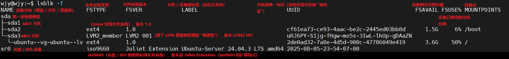
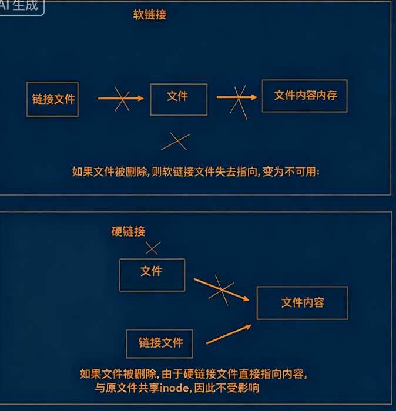
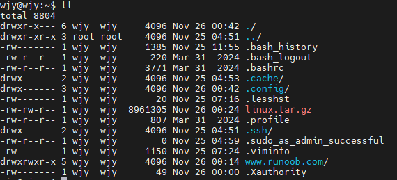

# Chapter 1. 前言

## Ⅰ Linux 简介

**操作系统定义：**所有硬件设备组装完成后的第一层软件，能够使用户使用硬件设备的软件即为操作系统

**Linux分类：**

- `Redhat` 系列：`OpenEuler`
- `Debian` 系列：`Ubuntu`


## Ⅱ 文件和路径


- `/`：根目录
- `/root`：系统管理员的目录
- `/usr`：系统应用程序存放的目录，一般安装的软件在这个目录
- `/etc`：系统配置文件存放的目录
- `/home`：系统普通用户的目录
- `/var`：放置系统执行过程中经常变化的文件，例如：日志文件
- `/bin`：存放着系统预设的执行文件


## Ⅲ 安装与连接

```bash
sudo apt install net-tools
```

要通过 `Mobaxterm` 连接这个Linux系统，需要先确认**Linux的SSH服务状态+网络互通**，再通过 `Mobaxterm` 新建SSH会话连接， 

先在Linux上准备SSH连接环境 

1. **安装SSH服务（如果没装）**   终端执行（需要管理员权限）：   

   ```bash
   sudo apt install openssh-server
   ```

2. **启动并开启SSH开机自启**   启动服务：

   ```bash
   sudo systemctl start ssh
   sudo systemctl enable ssh
   ```

3. **确认防火墙放行SSH（22端口）**   若系统开了防火墙，执行：  

    ```bash
    sudo ufw allow 22  # 放行22端口（SSH默认端口）
    sudo ufw reload    # 重载防火墙规则
    ```

用`Mobaxterm`连接的操作步骤 

1. 打开`Mobaxterm`，点击左上角的 **“Session”**（会话）按钮。 
2. 在弹出的窗口中，选择 **“SSH”** 选项。 
3. 在 **“Remote host”** 栏输入Linux的IP地址：`192.168.137.128`（从你提供的截图里能看到这个IP）。 
4. 在 **“Specify username”** 栏输入Linux的用户名（比如截图里的`wjy`）。 
5. 点击 **“OK”**，然后在弹出的终端里输入该Linux用户的密码，即可完成连接。  


## Ⅳ Linux 分区

分区是硬盘的分区

目录是 Linux 的目录

安装 Linux 时，可以把不同的分区挂载到指定目录


### 一、为什么分区

1. 数据安全与隔离
2. 系统稳定性保障
3. 性能优化
4. 管理便捷
5. 多系统支持与灵活性


### 二、典型分区方案示例

| 分区  | 用途       | 说明                                           |
| ----- | ---------- | ---------------------------------------------- |
| /**   | 根分区     | 系统核心，包含内核、启动文件和基本系统工具     |
| /boot | 启动分区   | 存放引导加载程序和内核镜像，确保系统能正常启动 |
| /home | 用户主目录 | 存放所有用户文件，便于备份和系统重装时保留     |
| /var  | 可变数据   | 存放日志、缓存、临时文件等经常变动的数据       |
| /tmp  | 临时文件   | 存放临时数据，系统重启时自动清空               |
| SWAP  | 交换空间   | 内存不足时作为虚拟内存，支持系统休眠           |


### 三、怎么查看分区

```bash
df -h
mount
lsblk -f
```




### 四、软链接与硬链接

#### 软链接

默认创建的是「软链接」（`ln -s`），软链接本质是指向源文件的「快捷方式」，操作软链接等价于操作源文件，因此会出现双向内容同步的效果（这是核心逻辑）。

- 关键解释：
  - `ln -s` 是创建「软链接」的命令（不加 `-s` 是硬链接，日常用软链接更多）；
  - 语法：`ln -s 源文件 链接文件`（**源文件在前，链接文件在后**，别写反！）；
  - 验证：执行 `ls -l`，会看到类似输出 `lrwxrwxrwx 1 user group 4 11月 27 15:00 ldemo -> demo`，其中 `->` 表示 `ldemo` 指向 `demo`。
- 软链接本身不存储内容，仅指向源文件，修改软链接 = 修改源文件，因此 `demo` 内容会同步变化。
- 源文件是内容的实际存储载体，软链接始终指向源文件，因此源文件内容变化后，通过软链接查看会直接显示最新内容。


**为什么要设计这种机制**

1. **「快捷访问」：不用记超长路径**

   如果一个文件藏在很深的目录里（比如 `~/文档/工作/项目/2025Q4/最终报告.pdf`），每次访问都输完整路径会很麻烦。这时候给它在桌面建个软链接：`ln -s ~/文档/工作/项目/2025Q4/最终报告.pdf ~/桌面/报告链接`，之后直接点桌面的 “报告链接” 就能打开文件，不用再逐层找目录。

2. **「依赖兼容」：解决软件 “认旧名” 的问题**

   很多程序运行时会依赖特定名称的库文件，但系统更新后库文件的版本号可能变了（比如系统里只有 `libxxx.so.3`，但老程序非要找 `libxxx.so`）。这时候不用重新编译程序，只要建个软链接：`ln -s libxxx.so.3 libxxx.so`，程序就能通过旧名称找到新库文件，直接正常运行。

3. **「资源复用」：节省空间 + 保持内容同步**

   如果多个场景需要用到同一个文件（比如团队共享一份数据文件），直接复制会占多份空间，而且改了其中一个副本，其他副本还会是旧的。用软链接的话，所有人都建一个指向源文件的软链接（比如源文件在 `/共享/数据.csv`，每个人建 `ln -s /共享/数据.csv ~/我的目录/数据链接`）：

   - 只存一份源文件，节省磁盘空间；
   - 不管改源文件还是改软链接，内容都会同步，永远访问的是最新版本。

4. **「跨分区管理」：硬链接做不到的事**

   硬链接（不带 `-s` 的 `ln`）不能跨文件系统 / 分区，但软链接可以 —— 比如源文件在 C 盘，软链接可以建在 D 盘，照样能正常访问源文件，灵活度更高。


#### 硬链接

硬链接可以理解成**源文件的 “分身”**，它和源文件共享同一个「文件身份证」（Linux 里叫 inode，存着文件的权限、大小等信息，实际内容存在同一个数据块里），核心特点很简单：

1. **核心逻辑**

- 命令：`ln 源文件 硬链接名`（注意不带 `-s`，这是和软链接的关键区别）；
- 用 `ls -i` 查看会发现：硬链接和源文件的`inode号完全一致`（软链接是单独的 inode）。

**2. 关键特点**

- **不能跨分区**：不同分区的 inode 是独立的，硬链接没法共享其他分区的 inode；
- **不能链接目录**：防止出现循环引用（比如给目录建硬链接，会导致文件系统结构混乱，系统直接禁止）；
- **“删源文件不丢内容”**：只要还有至少一个硬链接存在，inode 和数据块就不会被删除，哪怕删了源文件，硬链接依然能正常访问内容。




# Chapter 2. Linux 命令

## Ⅰ 停止执行命令快捷键

```
ctrl+c
```


## Ⅱ 命令的基本组成

```bash
# 命令 [-选项] [参数]
command [-options] [parameter]
"""
commond:命令主体
[-options]:命令选项，根据命令可以显示更加丰富的数据
[parameter]:命令参数，命令的操作对象，一般文件、目录、用户和进程等都可以作为参数被命令操作
"""
```


## Ⅲ 处理目录的常用命令

```bash
ls（英文全拼：list files）: 列出目录及文件名
cd（英文全拼：change directory）：切换目录
pwd（英文全拼：print work directory）：显示目前的目录
mkdir（英文全拼：make directory）：创建一个新的目录
rmdir（英文全拼：remove directory）：删除一个空的目录
cp（英文全拼：copy file）: 复制文件或目录
rm（英文全拼：remove）: 删除文件或目录
mv（英文全拼：move file）: 移动文件与目录，或修改文件与目录的名称
touch：创建新文件或更新时间戳
```

你可以使用 `man [命令]` 来查看各个命令的使用文档，如 ：man cp。


### 一、 mv 命令

```bash
mv [选项] 源文件/目录 目标文件/目录
```

- 重命名文件
	```bash
	mv oldname.txt newname.txt
	```
	
- 移动文件到其他目录
	```bash
	mv document.pdf Documents/
	```
	
- 移动并同时重命名
	```bash
	mv report.docx Archive/report-2023.docx
	```
	
- 移动目录
	```bash
	mv photos/ Pictures/
	```
	
- 安全地移动（避免覆盖）

  ```bash
  - mv -i x.txt abc/
  ```


### 二、cp 命令

```bash
cp [选项] 源文件/目录 目标文件/目录
```

- 复制文件

  ```bash
  # 复制单个文件到指定目录
  cp file.txt /path/to/destination/
  
  # 复制并改名
  cp oldname.txt newname.txt
  
  # 复制多个文件到目标目录
  cp file1.txt file2.txt /path/to/destination/
  ```

- 复制目录

  ```bash
  # 递归复制整个目录（必须使用 -r 或 -a）
  cp -r /path/to/source_dir /path/to/destination_dir/
  
  # 归档复制（保留文件属性（权限、所有者、时间戳等），并递归复制目录。）
  cp -a /path/to/source_dir /path/to/destination_dir/
  ```

- 常用组合

  ```bash
  # 安全复制（覆盖前提示）
  cp -i file.txt /path/to/destination/
  
  # 显示复制过程
  cp -v file.txt /path/to/destination/
  ```

  

## Ⅳ 相对路径和绝对路径

- `..`：上一层目录
- `/`：根目录
- `~`：当前用户的家目录
  - `~` 是 Linux 中「用户目录」的快捷符号（等价于 `/home/用户名`，比如 `/home/ubuntu`），无论当前在哪个目录，`~` 都指向自己的用户目录；


## Ⅴ Linux 文件内容查看

```bash
cat  由第一行开始显示文件内容
tac  从最后一行开始显示，可以看出 tac 是 cat 的倒着写！
nl   显示的时候，顺道输出行号！
more 一页一页的显示文件内容
less 与 more 类似，但是比 more 更好的是，他可以往前翻页！
head 只看头几行
tail 只看尾巴几行
```


# Chapter 3. Linux 文件基本属性

在 Linux 中我们通常使用以下两个命令来修改文件或目录的所属用户与权限：

```bash
chown (change owner) ： 修改所属用户与组。
chmod (change mode) ： 修改用户的权限。
```



在 Linux 中第一个字符代表这个文件是目录、文件或链接文件等等。

- 当为 **d** 则是目录
- 当为` -` 则是文件
- 若是 **l** 则表示为链接文档(link file)；


如果用 `-`字符表示没有写权限。

第 **0** 位确定文件类型，第 **1-3** 位确定属主（该文件的所有者）拥有该文件的权限。第 **4-6** 位确定属组（所有者的同组用户）拥有该文件的权限，第 **7-9** 位确定其他用户拥有该文件的权限。


## 数字法修改权限

```bash
chmod 763 text
```

- 数字权限规则：`r=4`、`w=2`、`x=1`，权限值为对应权限的数字和；
- 拆解：
  - 拥有者（u）：`rwx` = 4+2+1 = 7；
  - 用户组（g）：`rw` = 4+2 = 6；
  - 其他用户（o）：`wx` = 2+1 = 3


## 字母法修改权限

```bash
chmod u=r,g=w,o=x cm_demo
```

- 关键解释：
  - `u` = user（文件拥有者），`g` = group（所属用户组），`o` = others（其他用户）；
  - `r` = 读权限，`w` = 写权限，`x` = 执行权限；
  - `=` 表示「直接设置」该用户的权限（覆盖原有权限）；
- 执行后用 `ls -l` 验证，权限字段会显示为 `-r---w--x`（对应 u=r、g=w、o=x）


# Chapter 4. 案例

## 案例 2: cat/more/grep/重定向/管道符/clear

桌面上打开终端窗口，执行如下操作：

1. 将根目录下所有文件的详细信息输出到 demo 文件中 (包含隐藏文件)
2. 直接查看 demo 文件的内容
3. 将 `/usr/bin` 目录下所有文件的详细信息追加到 demo 文件中
4. 以分屏的形式查看 demo 文件的内容
5. 查找 demo 文件内容中包含 `mysql` 的信息
6. 在 `/usr/bin` 目录下所有文件的信息中查找包含 `mysql` 的信息
7. 清空当前终端窗口中的内容

```bash
ls -la / > demo
cat demo
ls -la /usr/bin >> demo
more demo
grep "mysql" demo
ls -la /usr/bin | grep "mysql"
clear
```


## 案例3:head/tail/tail -f 

在桌面上打开终端窗口，执行如下操作： 

1. 将根目录下所有文件的详细信息输出到 demo 文件中 
2. 查看 demo 文件前5行内容 
3. 查看 demo 文件后5行内容 
4. 将 ping www.itheima.com 的信息输出到 ping.log 文件中 
5. 重新开启一个终端窗口，动态查看 ping.log 文件中的信息

```bash
ls -l / > demo
head -n 5 demo
tail -n 5 demo
ping www.itheima.com > ping.log
tail -f ping.log
```


## 案例4：重启关机/查看系统信息

1. 查看当前系统内核版本信息
2. 查找当前系统发行版本信息
3. 重启当前系统
4. 关闭当前系统

``` bash
uname -a
cat /etc/os-release
reboot
shutdown -h now
```


## 案例5：ps/kill/top

1. 查看当前系统的进程信息 centos7
2. 重新打开 mysql_8.6.46_centos7
3. 获取 neo4j_8.6.46_centos7 的进程信息(进程ID)
4. 通过结束neo4j_8.6.46_centos7 进程的方式关闭程序
5. 打开当前系统的“任务管理器”（动态查看进程信息）

```
ps -aux
sudo systemctl restart mysql_8.6.46_centos7
ps aux | grep neo4j_8.6.46_centos7 | grep -v grep
kill-9 进程号
top
```

### 端口号

1. **定义**：TCP/UDP 协议中，用于标识主机上特定进程的数字（进程与外界通信的 “门牌号”）
2. **范围**：0-65535（共 65536 个）
   - 0-1023：知名端口（系统 / 常用服务占用，需 root 权限启动）
   - 1024-49151：注册端口（应用程序常用，可手动配置）
   - 49152+：动态端口（临时分配，用完释放）
3. 常用端口号（测试工作高频场景）
   - 80：HTTP
   - 443：HTTPS
   - 22：SSH
   - 3306：MySQL


## 案例6：netstat / lsof

1. 查看当前系统中开放的端口有哪些 

   ```bash
   netstat -tulnp
   sudo lsof -i -P -n | grep LISTEN
   ```

2. 查看哪个程序正在使用 3306 端口(需要 root 用户权限)

   ```bash
   sudo netstat -tulnp | grep :3306
   sudo lsof -i :3306
   ```


## 案例7：chmod 修改文件权限

1. 在当前目录下创建文件 cm_demo 
2. 查看文件当前权限状态 
3. 使用字母法将文件权限修改为：拥有者：可读/用户组：可写/其他用户：可执行 
4. 使用数字法将文件权限修改为：拥有者：可读可写可执行/用户组：可读可写/其他用户：可写可执行

```python
touch cm_demo
ll
chmod u=r,g=w,o=x cm_demo
chmod 763 cm_demo
```


## 案例8: which/su/passwd/exit/who 

在桌面上打开终端窗口，执行如下操作：

1. 查看 MySQL 程序的存放位置 
2. 从普通用户切换至 root 用户，再从 root 用户切换回普通用户 
3. 查看当前系统中所有登录用户的信息 
4. 退出当前终端窗口

``` bash
which MySQL
su - root
su 普通用户名
who
exit
```


## 案例9：find 查找文件

在桌面上打开终端窗口，执行如下操作：

1. 在用户目录下创建 `adir`,`bdir` 两个文件夹
2. 在 `adir` 目录下创建文件 f_demo
3. 切换路径到 `bdir` 目录
4. 在 `/` 目录下从用户目录中查找 f_demo 文件

```bash
mkdir ~/adir ~/bdir
touch ~/adir/f_demo
cd ~/bdir
find ~ -name "f_demo"
```


## 案例10：ln -s

在桌面上打开终端窗口，执行如下操作：

1. 在当前路径下创建文件 demo
2. 给 demo 文件创建链接文件名为 ldemo
3. 修改 ldemo 链接文件的内容
4. 查看 demo 文件的内容是否同样变化
5. 修改 demo 文件内容，查看 ldemo 链接文件内容是否同样变化

```bash
touch demo
ln -s demo ldemo
# 向软链接追加内容（>> 是追加，不会覆盖原有内容，方便后续验证）
echo "修改软链接 ldemo 的内容" >> ldemo
cat demo
# 向源文件 demo 追加新内容
echo "修改源文件 demo 的内容" >> demo
# 查看软链接 ldemo 的内容
cat ldemo
```


## 案例11：tar/gzip/zip/unzip
