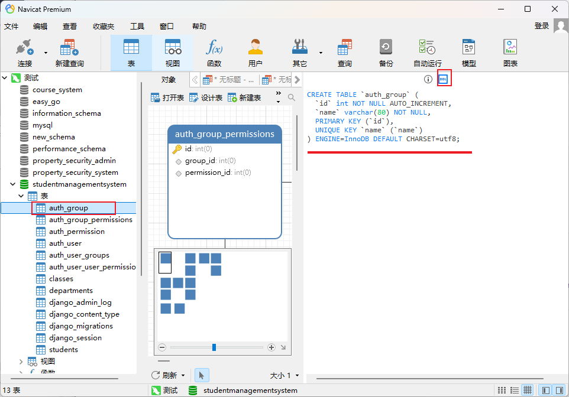
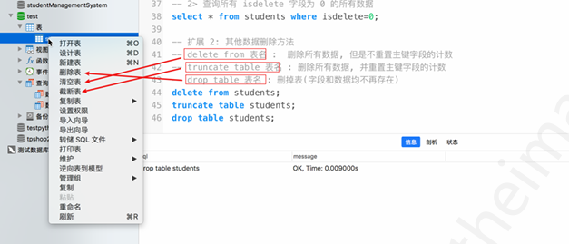
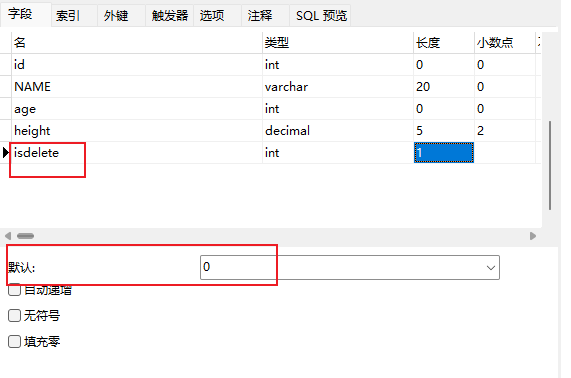

# Chapter 1. 数据库简介

## Ⅰ 数据库分类

- 关系型数据库 `RDMS`
  - MySQL
  - Oracle
- 非关系型数据库 ``
  - Redis（键值型key-value）
  - MongoDB（文档型）


## Ⅱ 数据类型

- 整数：`int`
  - 有符号整数：-(2^31-1)~2^31-1
  - 无符号整数：0~2^32-1
- 小数：`decimal(5,2)`表示共存 5 位数，小数占 2 位，整数占 3 位
- 字符串：`varchar`：0~65535
- 日期时间：`datetime`


## Ⅲ 约束

- 主键(primary key)：能唯⼀一标识表中的每⼀一条记录的属性组
- 非空(not null)：此字段不不允许填写空值
- 唯一(unique)：此字段的值不不允许重复
- 默认值(default)：当不不填写此值时会使⽤用默认值，如果填写时以填写为准
- 外键(foreign key)：⼀一个表中的⼀一个字段引⽤用另⼀一个表的主键


# Chapter 2. Navicat 图形页面化操作

## Ⅰ 整数无符号设置


## Ⅱ 约束

### 一、 主键&不为空


### 二、 唯一


### 三、 默认


## Ⅲ 打开命令行


## Ⅳ 数据库备份


# Chapter3. SQL语句

## Ⅰ 数据库操作

### 一、创建数据库

```sql
-- 创建数据库
CREATE DATABASE zq_test CHARSET=utf8 COLLATE=utf8_general_ci;
--查看数据库
SHOW CREATE DATABASE zq_test;
```


### 二、使用数据库

```sql
-- 切换数据库
use zq_test;
-- 查看当前库
SELECT DATABASE();
```


### 三、修改数据库编码格式&排序规则

```sql
ALTER DATABASE zq_test
DEFAULT CHARACTER SET utf8mb4
DEFAULT COLLATE utf8mb4_general_ci;
```


### 四、删除数据库和查看所有数据库

```sql
-- 删除数据库
DROP DATABASE zq_test;
--查看所有库
SHOW DATABASES;
```


### 五、数据库备份

```sql
# 备份语法：mysqldump -u用户名 -p密码 -h主机 -P端口 数据库名 [选项] > 备份文件.sql
mysqldump -uroot -p123456 - test_db > x.sql
# 还原语法：mysql -u用户名 -p密码 -h主机 -P端口 目标数据库名 < 备份文件.sql
mysql -uroot -p123456 test_db < x.sql
```


## Ⅱ 数据表操作

### 一、创建表

```sql
CREATE TABLE students ( 
    id INT UNSIGNED PRIMARY KEY auto_increment, 
    NAME VARCHAR ( 20 ), 
    age INT UNSIGNED, 
    height DECIMAL ( 5, 2 ) );
```


### 二、查看表

```sql
SHOW CREATE TABLE students;
```


### 三、先判断表是否存在，再移除并创建

```sql
DROP TABLE
IF
	EXISTS students;
CREATE TABLE students ( id INT UNSIGNED PRIMARY KEY auto_increment, NAME VARCHAR ( 20 ), age INT UNSIGNED, height DECIMAL ( 5, 2 ) );
```


### 四、通过Navicat工具获取创表语句的方法




### 五、查看表结构和删除表

```sql
-- 查看表结构(字段)
-- desc 表名;
DESC auth_group;
-- 删除表
-- drop table 表名;
drop table students;
```


## Ⅲ 数据操作

### 一、增加数据

#### 1.1 增加一行数据

```sql
-- 增加⼀行数据
-- insert into 表名 values(...)
-- 注意: 
-- 1. 数据值需要和表的字段⼀一对应(数据个数及数据类型)
-- 2. 主键列列是自动增长，插入时需要占位，通常使⽤用 0 或者 default 或者
INSERT INTO students
VALUES
	( 0, 'zhangsan', 28, 1.78 );
	
-- 增加部分字段
INSERT INTO students ( NAME, height )
VALUES
	( 'lisi', 1.68 );
```


#### 1.2 增加多行数据

```sql
insert into students values(0, '王五1', 29, 1.78),(0, '王五2', 
30, 1.78);
```


#### 1.3 修改数据

更新students表中，id=9的数据。将其age设为48

```sql
update students set age=48 where id=9;
```


### 二、删除数据

#### 2.1 三种删除命令

- `delete from 表名` :  删除所有数据, 但是不重置主键字段的计数
- `truncate table 表名` : 删除所有数据, 并重置主键字段的计数
- `drop table 表名` : 删掉表(字段和数据均不再存在)

```sql
DELETE FROM students WHERE id = 2;
TRUNCATE TABLE students;
DROP TABLE students;
```


#### 2.2 图形化界面



#### 2.3 逻辑删除

对于重要的数据，不能轻易执行 delete 语句进行删除。因为⼀旦删除，数据⽆法恢复，这 时可以进⾏逻辑删除。 

1. 给表添加字段，代表数据是否删除，⼀般起名 `isdelete`，0代表未删除，1代 表删除，默认值为0
2. 当要删除某条数据时，只需要设置这条数据的 isdelete 字段为1 
3. 以后在查询数据时，只查询出 `isdelete` 为 0 的数据



```sql
-- 将id4的数据设为删除
UPDATE students 
SET isdelete = 1 
WHERE
	id = 4;

-- 查询所有未删除数据
SELECT
	* 
FROM
	students 
WHERE
	isdelete = 0;
```

