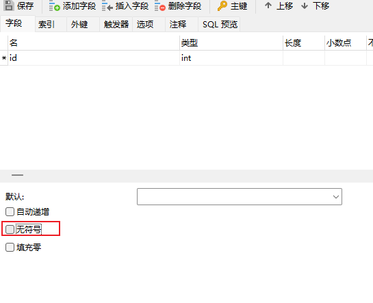
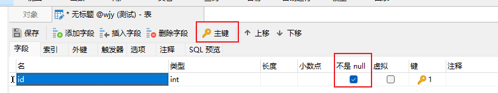
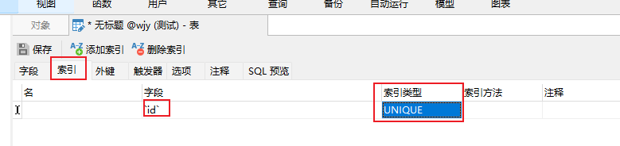
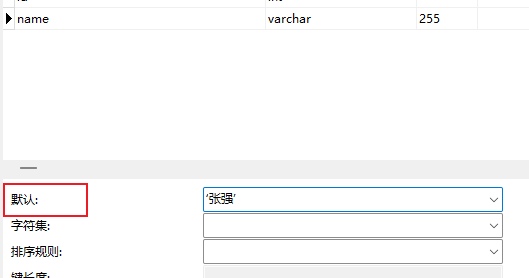
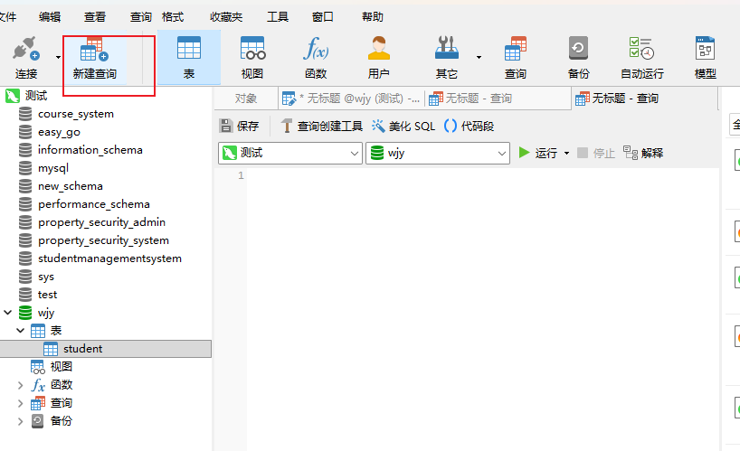
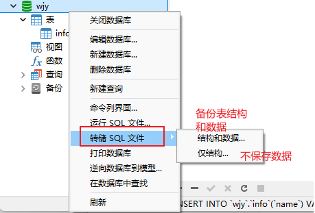
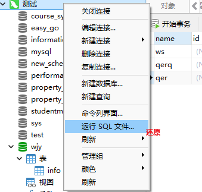

# Chapter 1. 数据库简介

## Ⅰ 数据库分类

- 关系型数据库 `RDMS`
  - MySQL
  - Oracle
- 非关系型数据库 ``
  - Redis（键值型key-value）
  - MongoDB（文档型）


## Ⅱ 数据类型

- 整数：`int`
  - 有符号整数：-(2^31-1)~2^31-1
  - 无符号整数：0~2^32-1
- 小数：`decimal(5,2)`表示共存 5 位数，小数占 2 位，整数占 3 位
- 字符串：`varchar`：0~65535
- 日期时间：`datetime`


## Ⅲ 约束

- 主键(primary key)：能唯⼀一标识表中的每⼀一条记录的属性组
- 非空(not null)：此字段不不允许填写空值
- 唯一(unique)：此字段的值不不允许重复
- 默认值(default)：当不不填写此值时会使⽤用默认值，如果填写时以填写为准
- 外键(foreign key)：⼀一个表中的⼀一个字段引⽤用另⼀一个表的主键


# Chapter 2. Navicat 图形页面化操作

## Ⅰ 整数无符号设置



## Ⅱ 约束

### 一、 主键&不为空




### 二、 唯一




### 三、 默认




## Ⅲ 打开命令行



## Ⅳ 数据库备份






# Chapter3. SQL语句

## Ⅰ 数据库操作

### 一、创建数据库

```sql
-- 创建数据库
CREATE DATABASE zq_test CHARSET=utf8 COLLATE=utf8_general_ci;
--查看数据库
SHOW CREATE DATABASE zq_test;
```


### 二、使用数据库

```sql
-- 切换数据库
use zq_test;
-- 查看当前库
SELECT DATABASE();
```


### 三、修改数据库编码格式&排序规则

```sql
ALTER DATABASE zq_test
DEFAULT CHARACTER SET utf8mb4
DEFAULT COLLATE utf8mb4_general_ci;
```


### 四、删除数据库和查看所有数据库

```sql
-- 删除数据库
DROP DATABASE zq_test;
--查看所有库
SHOW DATABASES;
```


### 五、数据库备份

```sql
# 备份语法：mysqldump -u用户名 -p密码 -h主机 -P端口 数据库名 [选项] > 备份文件.sql
mysqldump -uroot -p123456 - test_db > x.sql
# 还原语法：mysql -u用户名 -p密码 -h主机 -P端口 目标数据库名 < 备份文件.sql
mysql -uroot -p123456 test_db < x.sql
```


## Ⅱ 数据表操作