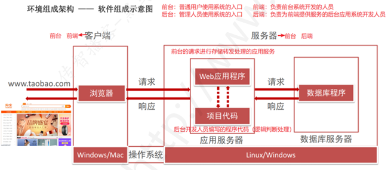

# Chapter1. 熟悉项目

## Ⅰ web 项目的组织架构图 -- 软件层面

**作用**：通过硬件及软件系统层面介绍服务器环境的构成

### 一、环境组成架构 -- 软件组成示意图

### 二、服务器组件构成

- web 服务器：主要对于客户端页面请求进行数据存储转发处理过程
- 数据库服务器：项目中的大批量数据进行存储管理
- PHP 项目：对于被测软件系统的业务逻辑的判断处理

## Ⅱ Web 环境基本组成

| 组成部分           | 常见组合（PHP 项目） |
| ------------------ | -------------------- |
| 操作系统           | Linux/Windows        |
| 应用服务器         | Apache/Nginx         |
| 数据库服务器       | MySQL/Oracle         |
| 项目语言环境及代码 | PHP + 项目代码       |

### 一、常见环境组合说明

- `LNMP`：`Linux` + `Nginx` + `MySQL` + `PHP`
- `LAMP`：`Linux` + `Apache` + `MySQL` + `PHP`
- `WAMP`：`Windows` + `Apache` + `MySQL` + `PHP`

### 二、组件说明【补充】

1. 常见 web 服务器：
   - Apache：稳定性比较好，对于 PHP 项目的支持非常好
   - Nginx：并发性（性能）比较好，常常和其他 web 服务器一起结合使用
   - Tomcat：针对于 Java 项目进行的 web 服务器的部署
   - IIS：针对于 Windows Server 系统的 web 服务器的部署
2. Apache 和 Nginx 区别：
   - Apache 的稳定性较好，对于 PHP 项目的支持非常稳定
   - Nginx 的并发性比较好，适用于性能要求较高的项目
   - 实际工作中可以配合一起使用
3. 数据库软件：MySQL、Oracle
4. 说明：同等位置的组件可以用同类型的组件进行替换

## Ⅲ 如何熟悉项目

### 一、熟悉项目的作用

- 一般进入公司需要干的第一件事（知道干什么，以及怎么干）
- 面试时简历项目的介绍
- 清楚项目中核心模块（单个模块能干什么）
- 清楚项目中的业务逻辑（用户如何使用）

### 二、熟悉项目的步骤

1. 熟悉项目的用户和角色（项目是给谁用的？）
   - 示例（淘宝）：普通网购用户、内部管理人员
2. 熟悉项目的组织架构（项目包含的功能模块有哪些？）
   - 示例（淘宝）：注册登录、搜索、商品详情、添加购物车、下单、支付、收货、评价、售后
3. 熟悉项目的核心功能模块（项目中最重要的功能模块有哪些？）
   - 项目组织架构图中涉及到核心业务流程的功能模块
4. 熟悉项目的核心业务流程（项目是做什么的？）
   - 项目中不同角色的用户如何使用系统以完成对应的业务工作流程

### 三、熟悉项目的依据

- 文档：需求文档、设计文档、用户手册、测试用例等
- 环境：测试环境、生成环境
- 人员：测试人员、产品、开发等