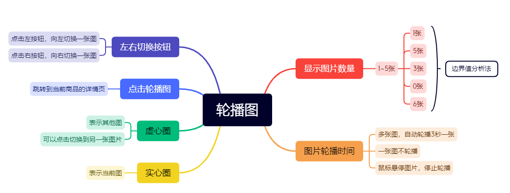
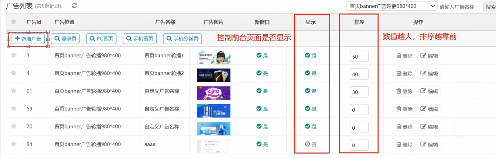
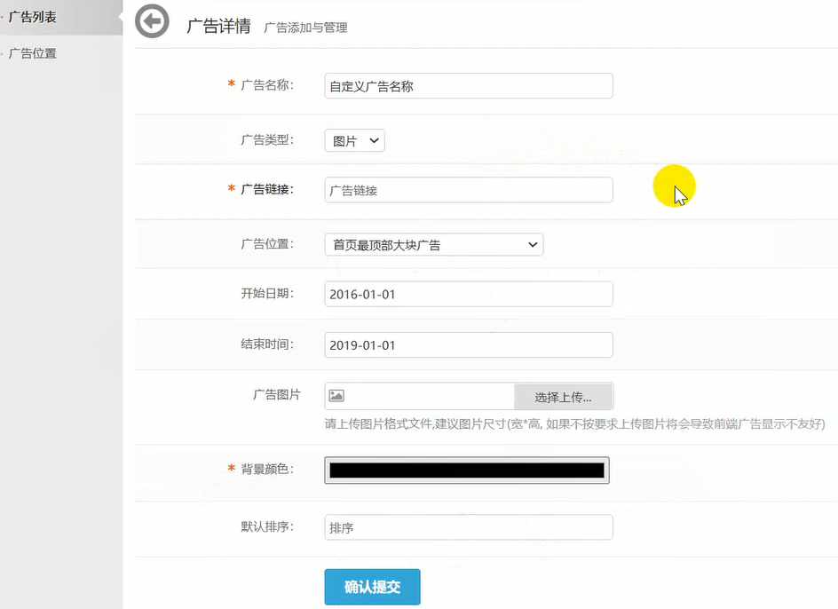

# Chapter1. 熟悉项目

## Ⅰ web 项目的组织架构图 -- 软件层面

**作用**：通过硬件及软件系统层面介绍服务器环境的构成


### 一、环境组成架构 -- 软件组成示意图


### 二、服务器组件构成

- web 服务器：主要对于客户端页面请求进行数据存储转发处理过程
- 数据库服务器：项目中的大批量数据进行存储管理
- PHP 项目：对于被测软件系统的业务逻辑的判断处理


## Ⅱ Web 环境基本组成

| 组成部分           | 常见组合（PHP 项目） |
| ------------------ | -------------------- |
| 操作系统           | Linux/Windows        |
| 应用服务器         | Apache/Nginx         |
| 数据库服务器       | MySQL/Oracle         |
| 项目语言环境及代码 | PHP + 项目代码       |


### 一、常见环境组合说明

- `LNMP`：`Linux` + `Nginx` + `MySQL` + `PHP`
- `LAMP`：`Linux` + `Apache` + `MySQL` + `PHP`
- `WAMP`：`Windows` + `Apache` + `MySQL` + `PHP`


### 二、组件说明【补充】

1. 常见 web 服务器：
   - Apache：稳定性比较好，对于 PHP 项目的支持非常好
   - Nginx：并发性（性能）比较好，常常和其他 web 服务器一起结合使用
   - Tomcat：针对于 Java 项目进行的 web 服务器的部署
   - IIS：针对于 Windows Server 系统的 web 服务器的部署
2. Apache 和 Nginx 区别：
   - Apache 的稳定性较好，对于 PHP 项目的支持非常稳定
   - Nginx 的并发性比较好，适用于性能要求较高的项目
   - 实际工作中可以配合一起使用
3. 数据库软件：MySQL、Oracle
4. 说明：同等位置的组件可以用同类型的组件进行替换


## Ⅲ 如何熟悉项目

### 一、熟悉项目的作用

- 一般进入公司需要干的第一件事（知道干什么，以及怎么干）
- 面试时简历项目的介绍
- 清楚项目中核心模块（单个模块能干什么）
- 清楚项目中的业务逻辑（用户如何使用）


### 二、熟悉项目的步骤

1. 熟悉项目的用户和角色（项目是给谁用的？）
   - 示例（淘宝）：普通网购用户、内部管理人员
2. 熟悉项目的组织架构（项目包含的功能模块有哪些？）
   - 示例（淘宝）：注册登录、搜索、商品详情、添加购物车、下单、支付、收货、评价、售后
3. 熟悉项目的核心功能模块（项目中最重要的功能模块有哪些？）
   - 项目组织架构图中涉及到核心业务流程的功能模块
4. 熟悉项目的核心业务流程（项目是做什么的？）
   - 项目中不同角色的用户如何使用系统以完成对应的业务工作流程


### 三、熟悉项目的依据

- 文档：需求文档、设计文档、用户手册、测试用例等
- 环境：测试环境、生成环境
- 人员：测试人员、产品、开发等


## Ⅳ 测试流程步骤

1. 需求评审
2. 编写测试计划和测试方案
3. 测试用例设计和评审
4. 测试执行并提交缺陷
5. 编写测试报告


### 一、需求评审

#### 1.1 参与评审目的

- 理解一致

- 查漏补缺

- 给出建议，指导执行

  

#### 1.2 评审形式

- 会议形式：适用于大多数项目，以下部门人员必须到场
  - 产品人员
  - 开发人员
  - 测试人员
- 邮件形式：适用于跨国项目


#### 1.3 注意事项

- 需求文档一般在开会前至少 2 小时发送给对应参会人员


#### 1.4 测试人员在需求评审中职责

- 理解需求
- 找出错误及遗漏的地方
- 给出合理建议


### 二、测试计划

- 明确测试目标和测试范围
- 执行计划的角色与职责
- 任务的进度安排与资源分配
- 风险估计和应急计划
- 测试的准入/准出标准


### 三、测试方案

- 测试策略：具体使用的方式方法，如何完成测试工作
- 测试环境的规划：具体实施需要的测试环境
- 测试工具的设计和选择：具体实施测试工作可能需要的一些工具


# Chapter2. 功能测试设计

将大块的需求整理拆分成可以直接测试的具体功能点过程

1. 需求文档，产品原型图，UI 设计图等
2. 以用户角度，待测试软件的可见功能


## Ⅰ 设计思路

- **熟悉需求**
  - 文档
    - 需求说明书
    - 原型图
    - UI 设计图
  - 环境
    - 测试环境
  - 人员
    - 测试
    - 开发
- **测试点整理（将测试文档整理成可直接编写测试用例的程度）**
  - 根据需求拆分不同的功能点
    - 观察法
    - 用例设计方法
  - 可以按照原型图拆分：所见即所测

- **编写测试用例**：按照用例模板编写
- **评审测试用例**
  - 查漏补缺
  - 理解一直
  - 指导执行
- **执行测试用例**
  - 顺序执行
  - 按照优先级执行
- **缺陷跟踪**
  - 测试失败
    - 提 bug
      - 可复现性
      - 唯一性
      - 规范性
    - 验证 bug
      - 回归测试
  - 测试通过：PASS


## Ⅱ 轮播图案例

### 一、熟悉需求：需求说明书

#### 1.1 前台

```
2.3.2 Banner轮播图

- a) 显示 1-5 张 banner 图片，自动轮播（3 秒切换 1 张）；若仅 1 张，则不轮播。
- b) 鼠标悬停图片时，停止轮播。
- c) 指示器样式：`○○○●○`（实心为当前图），点击（虚 / 实心圈、轮播图本身）可跳转对应图。
- d) 左右切换按钮：点击可切换上一张 / 下一张图。
```




#### 1.2 后台




