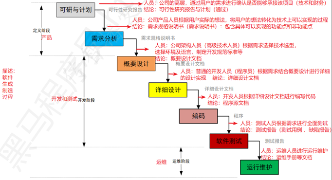
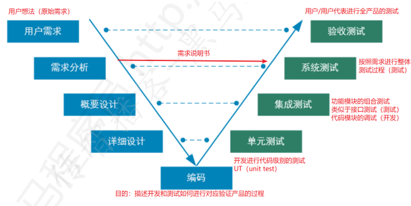
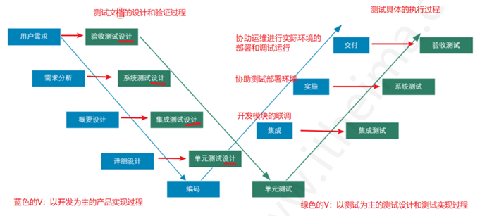
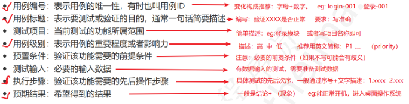
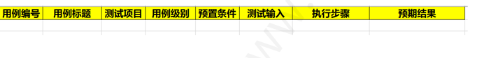
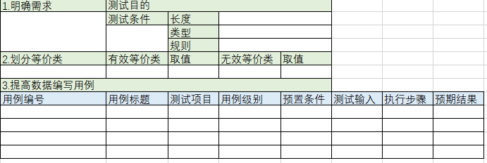
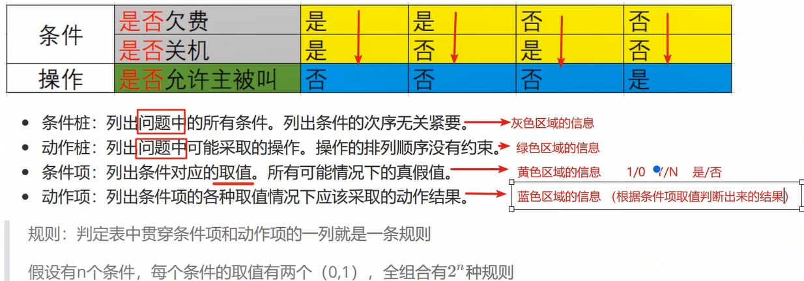

## 一、质量评判维度（8大维度）

| 质量维度       | 核心说明                                  | 示例                          |
|----------------|-------------------------------------------|-------------------------------|
| 功能           | 软件是否具备需求中规定的能力              | 某手机是否支持5G功能          |
| 性能           | 软件对时间、空间的占用程度                | APP启动速度快、占用内存小      |
| 兼容性         | 软件与其他软硬件的适配能力                | 某软件是否支持Windows/macOS系统|
| 易用性         | 软件是否容易理解、操作（符合用户使用习惯）| 财务系统的账单模块是否专业易懂|
| 可靠性         | 软件持续无故障运行的能力                  | 服务器7×24小时运行是否稳定    |
| 安全性         | 数据传输、存储的安全程度（专项测试）      | 用户密码是否加密存储          |
| 可移植性       | 软件从一个环境移植到另一个环境的运行能力  | 手机APP从Android 11移植到Android 14是否正常|
| 可维护性       | 软件出现故障后自我修复/恢复的能力        | 系统崩溃后是否能自动备份数据  |

## 二、软件生命周期（开发过程模型）

### 2.1 瀑布模型（基础模型）
#### 2.1.1 流程

  

#### 2.1.2 优缺点
- **优点**：每个阶段边界清晰，有明确文档产出；前一阶段完成后才进入下一阶段，流程严谨。  
- **缺点**：发现问题时机晚（测试介入在编码后），无法提前纠错；不适应需求变更。  

## 三、软件测试模型
### 3.1 V模型（开发与测试对应关系）
#### 3.1.1 流程（左：开发阶段 → 右：测试阶段）

#### 3.1.2 优缺点

- **优点**：测试阶段与开发阶段一一对应，流程清晰；从底层（代码）到高层（应用）全覆盖。  
- **缺点**：测试介入晚（编码后），不适应需求变更。

### 3.2 W模型（测试细化模型）

#### 3.2.1 核心改进

#### 3.2.2 优缺点

- **优点**：测试介入早（需求阶段即开始设计测试文档），能及时发现问题，降低修复成本；测试对象不仅是程序，还包括需求、设计文档。  
- **缺点**：应用复杂度高（需同时具备技术、业务、管理能力）。

# Chapter4. 测试用例

## Ⅰ 测试用例定义
为特定目的设计的“测试输入、执行条件、预期结果”的集合，本质是“将需求拆分为可执行的小测试点”。

## Ⅱ 标准构成要素（通用模板）

# Chapter5. 等价类划分法

## Ⅰ 核心思想
将“批量测试数据”按“共同特征”划分为“等价类”，每个等价类中选取**1-2个代表性数据**作为测试用例，避免穷举测试（减少用例数量，提高效率）。

## Ⅱ 等价类分类
| 类型         | 定义                                 | 作用                     |
|--------------|--------------------------------------|--------------------------|
| 有效等价类   | 满足需求规格的输入数据               | 验证软件“是否实现正确功能” |
| 无效等价类   | 不满足需求规格的输入数据（含异常场景）| 验证软件“异常处理能力”   |

## Ⅲ 适用场景

针对“**有批量数据**输入”的测试场景（无法穷举所有数据），如输入框、下拉框、选择框等。

## Ⅳ 设计用例步骤（4步）

## Ⅴ 案例

==**测试“两位数之间的整数求和”（即：-99~99之间的整数求和）**==

### 步骤1：明确需求

- 测试目的：验证两位数整数是否能正常求和  
- 测试条件：输入为“两位数整数”
  - **长度**⭐
  - **类型**⭐（只要键盘能输入的都算）
  - **规则** ⭐

### 步骤2：划分等价类

| 等价类类型 | 等价类描述           | 示例数据     |
| ---------- | -------------------- | ------------ |
| 有效等价类 | 符合“两位数整数”规则 | -10、30、99  |
| 无效等价类 | 非整数（字母）       | "a"、"hello" |
| 无效等价类 | 非整数（中文）       | "十"、"一百" |
| 无效等价类 | 非整数（特殊符号）   | "@"、"#"     |
| 无效等价类 | 非整数（小数）       | 1.2，-3.4    |
| 无效等价类 | 位数超过2位          | 100、-123    |
| 无效等价类 | 位数小于2位          | -1、2        |
| 无效等价类 | 空值                 | 空           |
| 无效等价类 | 空格                 | "  "         |

### 步骤3：提取测试数据

- 有效：30、-50  
- 无效："a"、"#"、100、-100、空  

### 步骤4：编写用例（部分示例）

# Chapter6. 边界值分析法
## Ⅰ 引入场景
开发人员常在“数据边界”处出现逻辑错误（如“≥10”误写为“>10”），因此需专门针对边界设计测试用例，核心是“**测试边界及边界附近的值**”。

## Ⅱ 核心概念（3类值）

| 概念   | 定义                                  | 示例（需求：输入1~100的整数） |
|--------|---------------------------------------|--------------------------------|
| 上点   | 刚好等于边界的值（不考虑区间开闭）    | 1（下边界上点）、100（上边界上点） |
| 离点   | 刚好小于/大于边界的值（需考虑开闭区间）| 闭区间[1,100]：0（下离点）、101（上离点）；开区间(1,100)：2（下离点）、99（上离点）==**开内闭外**== |
| 内点   | 边界范围内的任意值（建议取中间值）    | 50、60                        |

## Ⅲ 设计用例步骤

### 3.1 离点优化（减少用例数量）

#### 优化原则：“开内闭外”
- 若边界为**闭区间**（如[1,100]）：离点取“区间外”的值（0、101）  
- 若边界为**开区间**（如(1,100)）：离点取“区间内”的值（2、99）  

### 3.2 适用场景

- 对“等价类划分法”的补充（覆盖边界风险）；  
- 针对“有明确边界范围”的批量输入测试（如输入框、数值选择器）。

# Chapter7. 判定表法（多条件组合测试）

## Ⅰ 引入场景
当需求中存在“多个条件”，且条件之间有“组合关系”、条件与结果有“因果关系”时（如“如果A且B，则执行C”），需用判定表梳理所有组合场景，避免遗漏。

## Ⅱ  判定表构成

## Ⅲ 适用场景与局限性

- **适用场景**：需求含“多条件组合”“因果关系”（常见关键词：如果...那么...、若...则...）；  
- **局限性**：条件个数不宜过多（建议≤4个），超过4个时需用“因果图法”（需额外学习）。

# 三、场景法（流程测试）

### 3.1 核心定义
也叫“流程图法”，通过“业务流程图”描述用户的完整使用流程，验证“整个系统的业务逻辑”是否正常（不仅关注单个功能，还关注模块组合）。

### 3.2 核心思路
- 用户视角：关注“完整使用流程”（如“ATM取款”：插卡→输密码→选取款→输金额→取钞→退卡）；  
- 测试视角：覆盖“正常流程”和“异常流程”（如密码错误、余额不足等异常分支）。

### 3.3 适用场景
- 测试后期（功能模块已完成），需验证“跨模块组合流程”；  
- 基于“业务流程图”的端到端测试（如电商下单流程、支付流程）。

### 3.4 业务流程图绘制（补充）
#### 3.4.1 常用工具
- 本地工具：Microsoft Visio  
- 在线工具：[ProcessOn](https://www.processon.com/)（免费可用）  
- 简易工具：Excel（插入形状组合）

#### 3.4.2 图形含义
| 图形       | 含义                          |
|------------|-------------------------------|
| 椭圆       | 流程的“开始”或“结束”          |
| 长方形     | 流程中的“处理/操作”（如“插银行卡”） |
| 菱形       | 流程中的“判断节点”（如“密码正确？”） |
| 平行四边形 | 流程中的“数据输入/输出”（如“输出取款金额”） |
| 箭头线     | 流程的“走向”（可标注分支说明） |

#### 3.4.3 示例：ATM取款基本流程图

### 3.5 设计用例步骤
1. 绘制“业务流程图”（需覆盖正常+异常分支）；  
2. 识别流程图中的“所有路径”（每条路径对应一个场景）；  
3. 每条路径转化为一条测试用例（按模板填写步骤和预期结果）。

## 四、错误推测法（经验驱动测试）
### 4.1 核心定义
由“有项目经验的测试人员”通过“直觉/经验”，推测系统可能出现问题的地方，补充测试（无固定流程，依赖经验）。

### 4.2 适用场景
#### 场景1：时间紧迫时
- 核心动作：提取“核心模块”（历史问题多的模块），优先测试高风险点；  
- 操作建议：用XMind整理核心测试点，由资深测试人员执行，可结合自动化提高效率。

#### 场景2：时间宽裕时
- 核心动作：在基础测试完成后，细化“历史问题多的模块”，补充异常场景测试；  
- 操作建议：完善原有用例，按用例逐一执行，确保无遗漏。

### 4.3 关键问题：是否需要测试用例？
- 场景1（时间紧）：需提取“核心模块的高优先级用例”（避免无目标测试）；  
- 场景2（时间宽裕）：需细化并完善用例，按用例执行（保证可复现性）。

# 测试理论第三天笔记

## 今日目标
- 根据缺陷报告模板编写缺陷报告  
- 说出缺陷的跟踪流程  
- 熟悉禅道的使用（测试用例与缺陷管理）  

## 昨日回顾
参见课堂资料xmind：测试理论第二天(回顾).xmind（核心回顾“边界值分析法”“判定表法”“场景法”）

## 一、软件缺陷（Bug）基础
### 1.1 缺陷定义
软件在运行过程中存在的“错误、异常、失效”等问题，判定核心依据是“**需求规格说明书**”——实际产品与需求不一致，即为缺陷。

### 1.2 缺陷判定标准（5类场景）
| 判定标准                 | 说明                                  | 示例                          |
|--------------------------|---------------------------------------|-------------------------------|
| 未实现需求明确的功能     | 需求写了“要做”，但产品没实现          | 需求要求“支持指纹登录”，实际无该功能 |
| 出现需求禁止的错误       | 需求写了“不能出现”，但产品出现了      | 需求要求“登录失败需提示原因”，实际无提示 |
| 实现功能超出需求范围     | 需求没写“要做”，但产品多做了          | 计算器需求仅含“加减乘除”，实际多了“开方”功能 |
| 未实现需求隐含的功能     | 需求没明写，但用户默认需要的功能      | 金额显示默认保留2位小数（需求未写，但属于常识），实际未保留 |
| 用户体验差（不完美）     | 功能能实现，但易用性、性能差          | 点击“提交”后，等待10秒才响应；界面按钮位置混乱 |

### 1.3 缺陷级别（按严重程度划分）
| 级别       | 定义                                  | 对应判定标准场景               |
|------------|---------------------------------------|--------------------------------|
| 高严重级   | 影响核心功能，导致系统无法使用或数据风险 | 1（未实现核心功能）、2（出现致命错误）、3（功能超范围导致混乱） |
| 中低级     | 不影响核心功能，仅体验或细节问题       | 4（隐含功能缺失）、5（用户体验差） |

## 二、缺陷产生的原因（按阶段划分）
分析原因的目的：定位质量问题根源，优化后续开发流程。

| 产生阶段   | 具体原因                                  | 示例                          |
|------------|-------------------------------------------|-------------------------------|
| 需求阶段   | 需求描述有歧义、错误、不完整              | 需求写“用户名支持特殊字符”，未说明哪些特殊字符（如@是否允许） |
| 设计阶段   | 设计文档逻辑错误、模块接口不清晰          | 设计文档中“支付模块”与“订单模块”的数据传递规则未定义 |
| 编码阶段   | 代码语法错误、逻辑漏洞（如循环条件错误）  | 把“≥10”写成“>10”；变量名拼写错误 |
| 运行环境   | 软硬件环境故障（如服务器崩溃、浏览器兼容）| 软件在Chrome正常，在IE中按钮无法点击 |
| 故障修复   | 修复旧缺陷时引入新缺陷                    | 修复“登录超时”问题后，导致“注册功能”报错 |

### 关键问题：哪个阶段产生缺陷的比例最高？
**需求阶段**——需求文档不完善、有歧义或变更频繁，是导致后续缺陷的“根本原因”（需求错了，后续设计、编码都会跟着错）。

## 三、缺陷报告（核心文档）
### 3.1 缺陷报告的作用
- 记录缺陷的“完整信息”（便于开发定位和修复）；  
- 跟踪缺陷的“生命周期”（从发现到关闭的全过程）；  
- 留存证据（避免后续争议，便于复盘）。

### 3.2 缺陷报告的核心要素（必含）
| 要素         | 定义与要求                                                                 | 示例                          |
|--------------|----------------------------------------------------------------------------|-------------------------------|
| 缺陷标题     | 简洁描述“核心问题+现象”，格式：“模块+问题+现象”                             | 【后台会员管理】输入正确手机号添加会员失败，提示“手机号码有误” |
| 预置条件     | 执行缺陷复现的前提（与测试用例的预置条件一致）                             | 网络正常、已登录后台管理员账号、会员模块权限正常 |
| 复现步骤     | 清晰、可复现的操作步骤（含测试数据），按“1.XX；2.XX”格式                     | 1.进入“会员管理”页面；2.点击“添加会员”；3.输入手机号“13800138000”及其他信息；4.点击“提交” |
| 预期结果     | 需求要求的正确结果（与测试用例的预期结果一致）                             | 会员添加成功，提示“添加成功”，列表显示该会员 |
| 实际结果     | 实际出现的错误现象（“结论+细节”）                                         | 提示“手机号码有误”，会员未添加，列表无该会员 |
| 附件         | 证明缺陷的证据（截图、日志、录屏），优先提供“报错位置截图”                   | 报错提示弹窗的截图；后台日志文件（含报错时间、错误代码） |

### 3.3 缺陷报告的其他要素（辅助管理）
| 要素         | 定义与要求                                                                 | 可选值                          |
|--------------|----------------------------------------------------------------------------|---------------------------------|
| 缺陷编号     | 唯一标识（工具自动生成，如禅道、JIRA）                                     | Bug-001、DEF-20250601-001       |
| 缺陷状态     | 描述缺陷所处生命周期阶段（工具自动/手动更新）                               | New（新建）、Open（确认）、Fixed（已修复）、Closed（关闭）等 |
| 所属模块     | 缺陷所在的功能模块（与测试用例的“测试项目”一致）                             | 后台会员管理模块、前台登录模块 |
| 优先级       | 告诉开发“修复的紧急程度”（按业务影响排序）                                 | P1（最高）、P2（高）、P3（中）、P4（低） |
| 严重级       | 告诉产品“缺陷的破坏程度”（与优先级对应）                                   | S1（致命）、S2（高）、S3（中）、S4（低） |
| 缺陷类型     | 缺陷的问题类别（便于分类统计）                                             | 功能问题、UI问题、兼容性问题、易用性问题、安全问题 |
| 报告人       | 提交缺陷的测试人员姓名/账号                                               | 张三、test01                   |
| 报告时间     | 提交缺陷的时间（工具自动生成）                                             | 2025-06-01 14:30:00            |

### 3.4 编写缺陷报告的规范
1. **可复现**：步骤必须清晰，确保开发能100%复现缺陷（不可复现的缺陷需标注“偶现”并附日志）；  
2. **唯一性**：一个缺陷报告只报“一个问题”（避免“登录失败+密码明文存储”写在同一份报告中）；  
3. **规范性**：按公司模板填写，如客服发现的缺陷需在标题前加【客服】标识；  
4. **客观性**：描述无感情色彩、无模糊词汇（不用“好像”“大概”，不用“这明显是开发的错”）；  
5. **准确性**：数据、步骤无错误（如手机号、操作路径必须准确）。

## 四、缺陷的生命周期（跟踪流程）
### 4.1 核心状态流转（以“禅道”为例）
1. **New（新建）**：测试人员执行用例失败，提交缺陷，状态设为“New”；  
2. **Assigned（指派）**：测试/项目负责人审核缺陷，指派给对应开发人员，状态设为“Assigned”；  
3. **Open（确认）**：开发人员确认缺陷（不是误报/重复），状态设为“Open”；  
   - 若开发认为“不是缺陷”，状态设为“Rejected（拒绝）”，需附理由，测试人员确认后关闭或重新打开；  
4. **In Progress（处理中）**：开发人员开始修复缺陷，状态设为“In Progress”；  
   - 若开发认为“当前版本无法修复，需延后”，状态设为“Deferred（延迟修复）”，协商修复版本；  
5. **Fixed（已修复）**：开发完成修复，提交代码，状态设为“Fixed”，指派回测试人员；  
6. **Retest（回归测试）**：测试人员验证缺陷是否修复（回归测试）；  
   - 验证通过：状态设为“Closed（关闭）”；  
   - 验证失败：状态设为“Reopen（重新打开）”，回到“Assigned”阶段，重新流转。

### 4.2 关键问题
#### 问题1：测试人员何时提交缺陷报告？
执行测试用例“失败”时，需**立即停止该用例执行，马上提交缺陷**（避免后续忘记细节，无法复现）。

#### 问题2：能否口头传达缺陷，不写报告？
**不能**：口头传达无留存证据，易遗漏细节；缺陷报告是开发修复、团队协作的唯一依据。

#### 问题3：开发能否直接关闭缺陷？
**不能**：开发仅能将缺陷状态设为“Fixed（已修复）”或“Rejected（拒绝）”；“Closed（关闭）”必须由测试人员验证通过后设置（确保缺陷真的修复）。

## 五、缺陷管理工具：禅道（Zentao）
### 5.1 禅道简介
- 定位：国产项目管理工具，支持“测试用例管理”“缺陷管理”“任务管理”等，部分版本开源免费；  
- 核心理念：“三权分立”（产品、开发、测试部门独立权限）、“四角协同”（产品经理、项目经理、开发、测试协作）。

### 5.2 测试人员常用功能
#### 5.2.1 管理测试用例
1. **编写用例**：  
   - 入口：禅道→测试→用例→“+建用例”/“+批量建用例”；  
   - 填写内容：按“测试用例模板”填写（用例标题、所属模块、预置条件、步骤、预期结果等）。  
2. **评审用例**：  
   - 入口：禅道→测试→用例→筛选“待评审”用例；  
   - 操作：团队（产品、开发、测试）共同评审，确认用例是否覆盖需求、步骤是否可复现，评审通过后状态设为“正常”。  
3. **执行用例**：  
   - 入口：禅道→测试→测试单→选择对应测试单→“执行”；  
   - 记录结果：执行通过→“通过”；执行失败→“失败”，可直接跳转“提交缺陷”。

#### 5.2.2 管理缺陷报告
1. **提交缺陷**：  
   - 入口1：禅道→测试→Bug→“+提Bug”（手动提交）；  
   - 入口2：执行用例失败时，点击“转Bug”（自动带入用例的预置条件、步骤，无需重复填写）；  
   - 填写内容：按“缺陷报告要素”填写，必传附件（截图/日志）。  
2. **跟踪缺陷**：  
   - 入口：禅道→测试→Bug→筛选“我的Bug”/“未关闭Bug”；  
   - 操作：关注缺陷状态流转，开发修复后及时“回归测试”，更新状态。  
3. **验证缺陷**：  
   - 入口：禅道→测试→Bug→筛选“已修复”Bug；  
   - 操作：按“复现步骤”验证，通过则“关闭”，失败则“重新打开”。

### 5.3 其他常用缺陷管理工具
- JIRA：澳大利亚收费工具，功能强大，支持自定义流程（大型项目常用）；  
- TestLink：专注测试用例管理，可与Bugzilla联动；  
- Bugzilla：开源缺陷管理工具，轻量易用（小型项目常用）。

## 六、常见问题与面试题
### 6.1 问题：不可复现的Bug如何处理？
1. 多次尝试复现（至少3次），记录每次操作的“环境、步骤、数据”（如浏览器版本、操作时间）；  
2. 回顾操作细节：是否有“偶发条件”（如网络波动、并发操作），是否操作失误；  
3. 寻求开发协助：让开发帮忙查看“对应模块的日志”（如后台报错日志、接口请求日志），定位是否有隐藏错误；  
4. 更换环境验证：在其他测试环境（如测试服、预发布服）重复操作，确认是否环境问题；  
5. 后续版本跟踪：在后续迭代版本中，重点关注该功能，若再次出现，立即抓取日志并提交缺陷。

### 6.2 面试题：你发现一个Bug，开发不认为是Bug，如何处理？
1. 先排查“环境差异”：确认测试环境与开发环境是否一致（如版本、配置、数据），避免环境导致的认知偏差；  
2. 再核对“需求依据”：拿出“需求规格说明书”，指出Bug与需求的不一致之处（如需求原文截图）；  
3. 若需求不明确：联系产品经理确认需求细节，明确“正确预期”，再与开发对齐；  
4. 若仍有争议：组织小会（产品、开发、测试），共同评审Bug，以“用户需求”为核心判定标准，达成一致。

