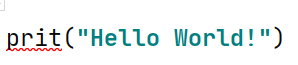
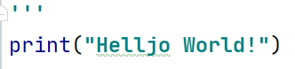
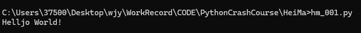
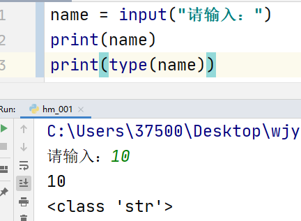

## 注释与print()

```python
# 单行注释

"""
多行注释
ctrl+shift+F10 运行代码
ctrl+alt+L 格式化代码
ctrl+D 复制当前行到下一行
Refactor 重命名
"""
'''
三个单引号也行
也是多行注释
'''
print("Hello World!")
```


## 三种波浪线和PEP8

- 红色：代码错误

  

- 灰色：不符合 PEP8 规范

  > PEP8: 是 Python 代码的书写规范, 如果不按照这个规范书 写,会给灰⾊波浪线提示,建议代码的书写按照 PEP8 的规范书写

- 绿色：不影响代码的执⾏, 认为你书写的内容不是⼀个单词

  

## 在 cmd 运行 python 代码

直接输入文件名




## 变量

- 作⽤: 是⽤来存储数据的(在程序代码中出现的数据,想要保存下来使⽤, 就必须使⽤变量), 如: 测试数据, ⽤户名, 密码, 验 证码 变量

- 注意事项: 变量必须先定义(保存数据)后使⽤(取出数据).
- 命名规范
  1. 必须由字⺟、数字、下划线组成, 并且不能以数字开头
  2. 不能使⽤ Python 中的关键字作为变量名
  3. 区分⼤⼩写

```py
name = "张三"
print(name)
```


## 数据类型

- 数字类型

  - 整型 int
  - 浮点型 float
  - 布尔类型 bool：True False

- 非数字类型

  - 字符串 str

  - 列表 list

    ```python
    [1, 2, 3, 4]
    ```

  - 元组 tuple

    ```python
    (1, 2, 3, 4)
    ```

  - 字典 dict

    ```python
    {'name': '1', 'age': 18}
    ```

---

 type(变量)：可以获取变量的数据类型

```python
# <class 'int'>
age = 18
print(type(age))

# <class 'float'>
height = 1.77
print(type(height))

# <class 'bool'>
isMen = True
print(type(isMen))

# <class 'str'>
name = 'xiaoming'
print(type(name))
```


## 类型转换--input函数

```python
"""
字符串变数字
"""
age = "20"
age1 = int(age)
# {'20'} {<class 'str'>}
print({age}, {type(age)})
# {20} {<class 'int'>}
print({age1}, {type(age1)})

"""
int变字符串
"""
height = 180
height1 = str(height)
# {180} {<class 'int'>}
print({height}, {type(height)})
# {'180'} {<class 'str'>}
print({height1}, {type(height1)})
```

- `int()`  将其他类型转换为 int 类型
  1. 可以将 `float`类型的数字转换为 `int`
  2. 可以将**==整数类型的字符串==**转换为 `int`
- `float()`  将其他类型转换为 float 类型
  1. 可以将 `int`类型的数字转换为 `float`
  2. 可以将**==浮点类型的字符串==**转换为 `float`
- `str()`  将其他类型转换为 字符串类型
  1. ==**任何类型**==转换为字符串


## 输入/格式化输出

### 输入



### 格式化输出

#### 一、% 格式化输出占位符

在字符串中指定的位置，输出变量中存储的值

1. 在需要使⽤变量的地⽅，使⽤特殊符号占位
2. 使⽤变量填充占位的数据

```python
name = 'xiaoming'
age = 18
height = 1.834567

# xiaoming,18,1.834567
print('%s,%d,%f' % (name, age, height))
```


#### 二、f-string 格式化方法

```python
name = 'xiaoming'
age = 18
height = 1.834567

# My name is xiaoming, age 18 , 1.834567m
print(f"My name is {name}, age {age} , {height}m")
```


#### 三、format()

```python
print('我的名字是{},年龄{}岁,身高{:.3f}m'.format(name, age, height))
```


## 算数运算符

| 运算符 | 功能                 | 示例                    | 结果               |
| ------ | -------------------- | ----------------------- | ------------------ |
| `+`    | 加法 / 字符串拼接    | `3 + 5` 或 `"a" + "b"`  | `8` 或 `"ab"`      |
| `-`    | 减法                 | `10 - 4`                | `6`                |
| `*`    | 乘法 / 字符串重复    | `4 * 7` 或 `"Hi" * 3`   | `28` 或 `"HiHiHi"` |
| `/`    | 除法（结果为浮点数） | `15 / 2`                | `7.5`              |
| `//`   | 整除（向下取整）     | `15 // 2` 或 `-15 // 2` | `7` 或 `-8`        |
| `%`    | 取余                 | `15 % 2` 或 `7 % 3`     | `1` 或 `1`         |
| `**`   | 幂运算               | `2 ** 3` 或 `5 ** 2`    | `8` 或 `25`        |


## 逻辑运算符

and----与

or----或

not----非


## if elif else

```python
if '判断条件1':
    print("1");
elif '判断条件2':
    print('当条件1不成立时 才进入elif')
else:
    print("剩余情况")
```

```python
score = int(input("请输入成绩："))
if score >= 90:
    print("优")
elif 80 <= score < 90:
    print("良")
elif 70 <= score < 80:
    print("中")
elif 60 <= score < 70:
    print("差")
else:
    print("不及格")
```

```python
import random

"""
石头1剪刀2布 3
"""
user = int(input("石头1剪刀2布 3"))
computer = random.randint(1, 3)
if user != 1 and user != 2 and user != 3:
    print("请输入正确数字")
elif user == computer:
    print("平局")
elif (user == 1 and computer == 2) or (user == 2 and computer == 3) or (user == 3 and computer == 1):
    print("玩家获胜")
else:
    print("电脑获胜")
```


## for 循环

```python
my_str = 'Hello world'
for i in my_str:
    print(i)
```

```python
# 循环5次
# range(n)：生成[0,n)之间的整数
for i in range(5):
    print(i)
#[5,10)
for j in range(5,10):
    print(j)
```


## break & continue

- break：终止循环
- continue：跳过本次循环，进入下一循环

```
for i in range(5):
    if i == 3:
        print("不打印3")
        continue
    print(i)
```


## 容器

### 字符串

字符串是容器

#### 定义

```python
# 1. 使用单引号定义
str1 = 'hello'
# 2. 使用双引号定义
str2 = "world"
# 3. 使用三引号定义
str3 = """!"""
str4 = '''!'''

str5 = "hell'o"
str6 = 'hell"o'
# 使用转义字符\
str7 = 'hell\'o'
```

和数组一样从0开使

最后一个可以是 -1


#### 切片

可以获取字符串中多个字符(多个字符的下标是有规律的,  等差数列）

`字符串[start:end:step]`

- start：开始位置的下标
- end：结束位置的下标
- step：等差数列差值

```python
str1 = "abcdefghijkl"

# abcdefgh 0 1 2 3 4 ...
print(str1[0:8:1])
#aceg 0 2 4 6
print(str1[0:8:2])
```


#### find()查找

在字符串中查找字符串

```
str1 = "abcdefghijkl"

num = str1.find('def', 2, 8)
print(num)
```


#### replace()替换

`字符串.replace(old_str, new_str, count)`  

- 将字符串中  old_str 替换为 new_str
- count：替换的次数，一般不写

```python
str1 = "aaa"
str2 = str1.replace('a', 'b', 2)
print(str1)  # aaa
print(str2)  # bba
```


#### split()分割

`字符串.split(sep, maxsplit)`

- 将字符串按照 sep 进⾏分割(拆分)
- sep：默认是不填 可以填 `空格`、`\n` 、`\t`

- maxsplit ：分割次数

```python
str1 = 'a and b and c and d.'
# ['a ', ' b ', ' c ', ' d.']
print(str1.split('and'))
# ['a', 'and', 'b', 'and', 'c', 'and', 'd.']
print(str1.split(' '))

```


#### join()连接

```python
list1 = ['good', 'good', 'study']
str1 = ' '.join(list1)
# good good study
print(str1)

str2 = ' and '.join(list1)
# good and good and study
print(str2)
```

