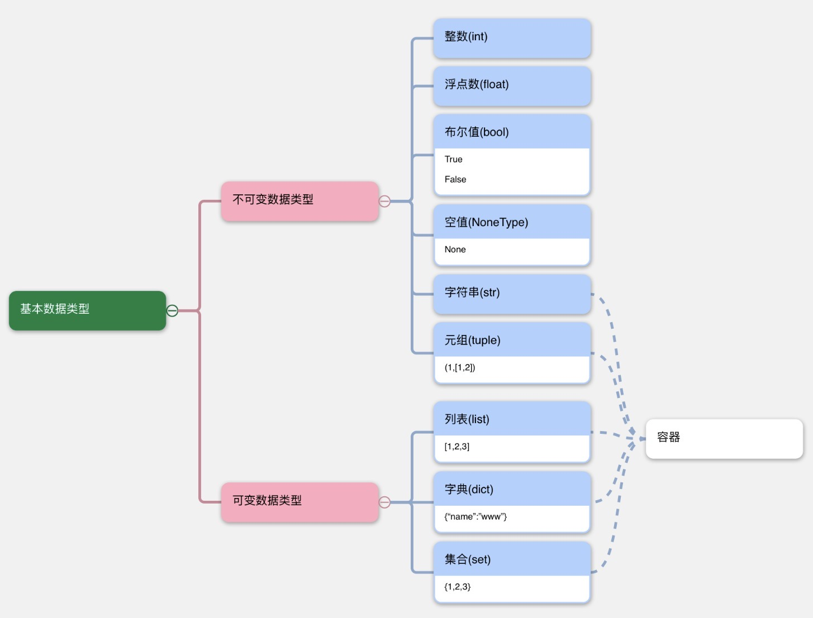
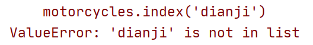
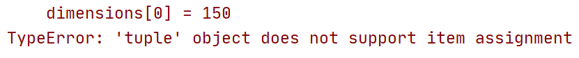

[Python 3.14.0 文档](./assets/python-3.14-docs-html/index.html)

## 数据类型



 type(变量)：可以获取变量的数据类型

```python
# <class 'int'>
age = 18
print(type(age))

```


## 类型转换--input函数

```python
"""
字符串变数字
"""
age = "20"
age1 = int(age)
# {'20'} {<class 'str'>}
print({age}, {type(age)})
# {20} {<class 'int'>}
print({age1}, {type(age1)})

"""
int变字符串
"""
height = 180
height1 = str(height)
# {180} {<class 'int'>}
print({height}, {type(height)})
# {'180'} {<class 'str'>}
print({height1}, {type(height1)})
```

- `int()`  将其他类型转换为 int 类型
  1. 可以将 `float`类型的数字转换为 `int`
  2. 可以将**==整数类型的字符串==**转换为 `int`
- `float()`  将其他类型转换为 float 类型
  1. 可以将 `int`类型的数字转换为 `float`
  2. 可以将**==浮点类型的字符串==**转换为 `float`
- `str()`  将其他类型转换为 字符串类型
  1. ==**任何类型**==转换为字符串


## 输入/格式化输出

### 输入


### 格式化输出

#### 一、% 格式化输出占位符

在字符串中指定的位置，输出变量中存储的值

1. 在需要使⽤变量的地⽅，使⽤特殊符号占位
2. 使⽤变量填充占位的数据

```python
name = 'xiaoming'
age = 18
height = 1.834567

# xiaoming,18,1.834567
print('%s,%d,%f' % (name, age, height))
```


#### 二、f-string 格式化方法

```python
name = 'xiaoming'
age = 18
height = 1.834567

# My name is xiaoming, age 18 , 1.834567m
print(f"My name is {name}, age {age} , {height}m")
```


#### 三、format()

```python
print('我的名字是{},年龄{}岁,身高{:.3f}m'.format(name, age, height))
```


## 算数运算符

| 运算符 | 功能                 | 示例                    | 结果               |
| ------ | -------------------- | ----------------------- | ------------------ |
| `+`    | 加法 / 字符串拼接    | `3 + 5` 或 `"a" + "b"`  | `8` 或 `"ab"`      |
| `-`    | 减法                 | `10 - 4`                | `6`                |
| `*`    | 乘法 / 字符串重复    | `4 * 7` 或 `"Hi" * 3`   | `28` 或 `"HiHiHi"` |
| `/`    | 除法（结果为浮点数） | `15 / 2`                | `7.5`              |
| `//`   | 整除（向下取整）     | `15 // 2` 或 `-15 // 2` | `7` 或 `-8`        |
| `%`    | 取余                 | `15 % 2` 或 `7 % 3`     | `1` 或 `1`         |
| `**`   | 幂运算               | `2 ** 3` 或 `5 ** 2`    | `8` 或 `25`        |


## 逻辑运算符

and----与

or----或

not----非


## if elif else

```python
if '判断条件1':
    print("1");
elif '判断条件2':
    print('当条件1不成立时 才进入elif')
else:
    print("剩余情况")
```

```python
score = int(input("请输入成绩："))
if score >= 90:
    print("优")
elif 80 <= score < 90:
    print("良")
elif 70 <= score < 80:
    print("中")
elif 60 <= score < 70:
    print("差")
else:
    print("不及格")
```

```python
import random

"""
石头1剪刀2布 3
"""
user = int(input("石头1剪刀2布 3"))
computer = random.randint(1, 3)
if user != 1 and user != 2 and user != 3:
    print("请输入正确数字")
elif user == computer:
    print("平局")
elif (user == 1 and computer == 2) or (user == 2 and computer == 3) or (user == 3 and computer == 1):
    print("玩家获胜")
else:
    print("电脑获胜")
```


## for 循环

```python
my_str = 'Hello world'
for i in my_str:
    print(i)
```

```python
# 循环5次
# range(n)：生成[0,n)之间的整数
for i in range(5):
    print(i)
#[5,10)
for j in range(5,10):
    print(j)
```


## break & continue

- break：终止循环
- continue：跳过本次循环，进入下一循环

```
for i in range(5):
    if i == 3:
        print("不打印3")
        continue
    print(i)
```


## 容器

### 字符串

字符串是容器

#### 定义

```python
# 1. 使用单引号定义
str1 = 'hello'
# 2. 使用双引号定义
str2 = "world"
# 3. 使用三引号定义
str3 = """!"""
str4 = '''!'''

str5 = "hell'o"
str6 = 'hell"o'
# 使用转义字符\
str7 = 'hell\'o'
```

和数组一样从0开使

最后一个可以是 -1


#### 切片

可以获取字符串中多个字符(多个字符的下标是有规律的,  等差数列）

`字符串[start:end:step]`

- start：开始位置的下标
- end：结束位置的下标
- step：等差数列差值

```python
str1 = "abcdefghijkl"

# abcdefgh 0 1 2 3 4 ...
print(str1[0:8:1])
#aceg 0 2 4 6
print(str1[0:8:2])
```


#### find()查找

在字符串中查找字符串

```
str1 = "abcdefghijkl"

num = str1.find('def', 2, 8)
print(num)
```


#### replace()替换

`字符串.replace(old_str, new_str, count)`  

- 将字符串中  old_str 替换为 new_str
- count：替换的次数，一般不写

```python
str1 = "aaa"
str2 = str1.replace('a', 'b', 2)
print(str1)  # aaa
print(str2)  # bba
```


#### split()分割

`字符串.split(sep, maxsplit)`

- 将字符串按照 sep 进⾏分割(拆分)
- sep：默认是不填 可以填 `空格`、`\n` 、`\t`

- maxsplit ：分割次数

```python
str1 = 'a and b and c and d.'
# ['a ', ' b ', ' c ', ' d.']
print(str1.split('and'))
# ['a', 'and', 'b', 'and', 'c', 'and', 'd.']
print(str1.split(' '))

```


#### join()连接

```python
list1 = ['good', 'good', 'study']
str1 = ' '.join(list1)
# good good study
print(str1)

str2 = ' and '.join(list1)
# good and good and study
print(str2)
```

#### 字符串反转

```python
字符串[::-1]
```


### 列表 list

列表 list, 是使⽤最多的⼀种容器(数据类型) 

```python
my_list = [1, 'xiaoming', 3.14, False]
# [1, 'xiaoming', 3.14, False]
my_list
# 1
my_list[0]
# False
my_list[-1]
# [1, 'xiaoming']
my_list[0:2]
# 4 长度
len(my_list)
# 1 查找在何位置
my_list.index('xiaoming', 0, 3)
# False 查找是否存在
'3.14' in my_list
# 1 统计出现次数
my_list.count(3.14)
# 尾部添加
my_list.append('19890913')
# 在指定下标位置添加
my_list.insert(0, 'happy')
# list2添加到list1后
list2.extend(list1)

```


# Chapter3. 列表简介

## Ⅰ 列表是什么

### 一、列表定义

**列表**是一系列按特定顺序排列的元素组成。可以将任何东西加入列表中

```python
bicycles = ['trek', 'cannondale', 'redline', 'specialized']
message = f"我的第一辆自行车是{bicycles[0].title()}牌的"
```


### 二、访问列表元素

列表是有序集合，索引从 0 开始。

通过索引指定为 -1 ，可让 Python 返回最后一个列表元素

```python
print(bicycles[0])  # trek
print(bicycles[1])  # cannondale
print(bicycles[3])  # specialized
print(bicycles[-1])  # specialized
print(bicycles[-2])  # redline
```


## Ⅱ 修改、添加、删除和查询元素

列表是可变数据类型

### 一、修改列表元素

```python
motorcycles = ['honda', 'yamaha', 'suzuki']
# ['honda', 'yamaha', 'suzuki']
print(motorcycles)
motorcycles[0] = 'ducati'
# ['ducati', 'yamaha', 'suzuki']
print(motorcycles)
```


### 二、在列表中添加元素

#### 2.1 使用append()在列表末尾添加元素

```python
motorcycles.append('哈雷')
# ['ducati', 'yamaha', 'suzuki', '哈雷']
print(motorcycles)
```

```python
# 使用append()动态创建列表
number_list = []
number_list.append(0)
number_list.append(1)
number_list.append(2)
```


#### 2.2 使用insert()在列表中插入元素

```python
motorcycles.insert(0, "雅迪")
# ['雅迪', 'ducati', 'yamaha', 'suzuki', '哈雷']
print(motorcycles)
```


### 三、在列表中删除元素

#### 3.1 使用del语句删除元素

```python
del motorcycles[0]
```


#### 3.2 使用pop()删除元素

`pop()` 删除列表末尾的元素，记录删除的元素

```python
motorcycles.pop()
motorcycles.pop(0)
```


#### 3.3 使用remove()根据值删除元素

删除列表中指定的元素，并记录删除的元素

```python
print(motorcycles.remove('雅迪'))# 雅迪
```


#### 3.4 清空数据(一般不用)

```python
motorcycles.clear()
```


### 四、在列表中查询元素

#### 4.1 index()

```python
motorcycles.index('dianji')
```




#### 4.2 count()

```python
# ValueError: 'dianji' is not in list
print(motorcycles.count('dianji'))
```


## Ⅲ 组织列表（列表排序）

### 一、使用sort()对列表永久排序

```python
cars = ['bmw', 'audi', 'toyota', 'subaru']
#升序
# ['audi', 'bmw', 'subaru', 'toyota']
cars.sort()

#降序
# ['toyota', 'subaru', 'bmw', 'audi']
cars.sort(reverse=True)

cars = ['Bmw', 'audi', 'toyota', 'subaru']
# ['Bmw', 'audi', 'subaru', 'toyota']
cars.sort()
```


### 二、使用sorted()对列表临时排序

```python
cars = ['bmw', 'audi', 'toyota', 'subaru']
# ['audi', 'bmw', 'subaru', 'toyota']
cars.sorted()
```


### 三、倒着打印列表

```python
cars.reverse()
```

```python
new_cars = cars[::-1]
```


### 四、确定列表的长度

```python
len(car)
```


# Chapter4. 操作列表

## Ⅰ 遍历整个列表

```python
magaicians = ['alice', 'david', 'carolina']
for magaician in magaicians:
    print(magaician)
```


## Ⅱ 创建数值列表

### 一、range()

`range()`函数

 ```python
 # 1~4
 for value in range(1, 5):
     print(value)
 ```

使用 `range()` 创建数字列表

```python
numbers = list(range(1, 6))
```

打印 1~10的 偶数

```python
even_numbers = list(range(2, 11, 2))
```

乘方计算

```python
squares = []
for value in range(1, 11):
    squares.append(value ** 2)
```

```python
# 第二种写法
squares = []
squares = [value ** 2 for value in range(1, 11)]
```


### 二、对数字列表执行简单的统计计算

```python
min(squares)
max(squares)
sum(squares)
```


## Ⅲ 使用列表的一部分

### 一、切片

```python
players = ['a', 'b', 'c', 'd', 'e']
# ['a', 'b', 'c']
print(players[0:3])
# ['a', 'b', 'c', 'd']
print(players[:4])
# ['c', 'd', 'e']
print(players[2:])
# ['c', 'd', 'e']
print(players[-3:])
# ['a', 'b', 'c', 'd', 'e']
print(players[:])
```


### 二、遍历切片

```python
for player in players[:3]:
    print(player)
```


### 三、复制列表

```python
my_foods = ['pizza', 'falafel', 'carrot cake']
friend_foods = my_foods[:]
```

```python
my_foods2=my_foods.copy()
```


## Ⅳ 元组 tuple

### 一、定义元组

Python 将不能修改的值称为**不可变的**，而**不可变的列表**被称为**元组**。

严格地说，元组是由逗号标识的，圆括号只是让元组看起来更整洁、清晰。

1. 元组中可以存放任意类型的数据 
2. 元组中可以存放任意多个数据

```python
# 定义一个大小不可变的矩形
dimensions = (200, 50)
print(dimensions[0])
print(dimensions[1])
```



---

如果要定义只包含一个元素的元组，必须在这个元素后面加上逗号。

```python
# 定义只包含一个元素的元组
my_t = (3,)
```


### 二、遍历元组中的所有值

像列表一样可以使用 for 循环遍历

```python
#元组遍历
for dimension in dimensions:
   print(dimension)
```


### 三、修改元组变量

**元组本身是不可变的（不能改、删、增元素），但 “指向元组的变量” 可以重新赋值（让变量指向一个新的元组）**

```python
(200,50)👈真正的元组，想把第一个数改成别的不行（不可直接改内部元素）
dimensions👈一个变量名（指向元组的“标签”）
重新定义一个新元组(250,50)并让
dimensions=(250,50)👈实现“修改元组变量”
```


### 四、元组常用方法

1. 在元组中也可以使⽤下标和切⽚获取数据 
2. 在元组中存在 `index` ⽅法, 查找下标, 如果不存在,会报错 
3. 在元组中存在 `count` ⽅法, 统计数据出现的次数 
4. 在元组中可以使⽤ `in` 操作, 判断数据是否存在
5. `len()` 统计个数 以上⽅法的使⽤ 和列表中⼀样的

