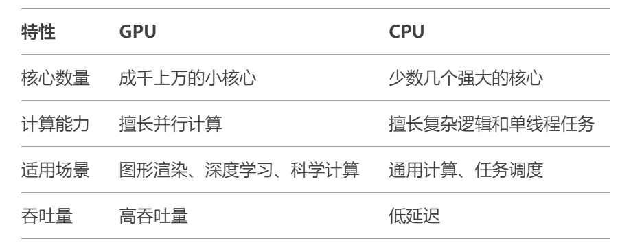
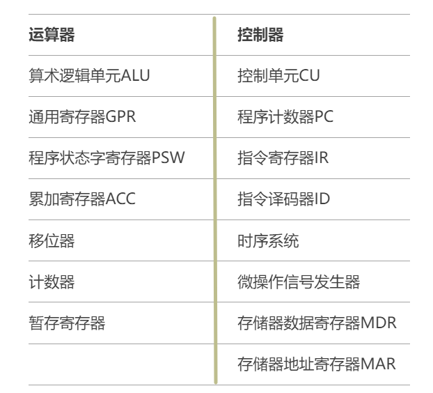
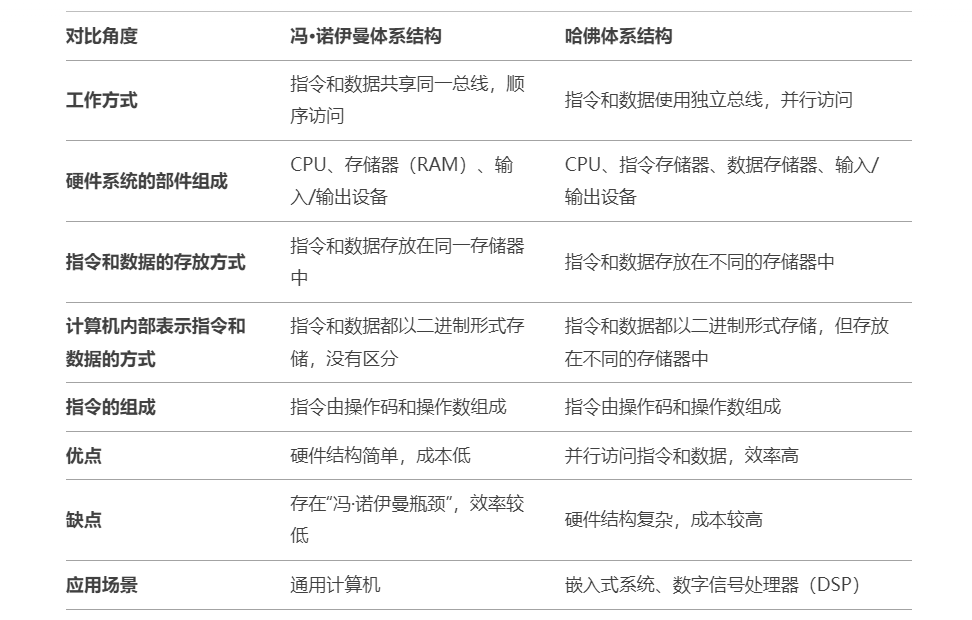
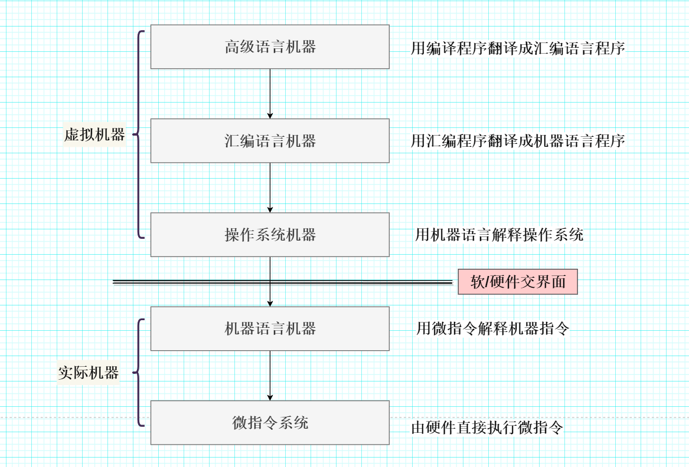

# 计算机系统常见面试题

## 1.CPU和GPU的主要区别是什么？

#### 【简要回答】

##### CPU和GPU的概念

- CPU（**Central Processing Unit**），即**中央处理器**，是计算机的主要设备之一，负责解释计算机指令，协调并控制计算机各组件正确地执行指令序列，并根据指令对数据进行加工。
- GPU（**Graphics Processing Unit**），即**图形处理器**，是一种专门设计用于处理**图形渲染**和**并行计算**的处理器。GPU具有大量的核心，能够同时执行大量简单的计算任务，适用于处理图形、视频、科学计算和机器学习等需要高并行计算能力的任务。

##### CPU和GPU的区别

- 如下表所示：

   

  

------

#### 【详细回答】

- CPU主要由**运算器**和**控制器**两部分构成，注意——有时候我们也将CPU分为**数据通路**和**控制部件**两部分，这两种分法并不矛盾，前者是从功能模块的角度对CPU进行划分，后者则是从硬件实现的角度对CPU进行划分。
- CPU的具体功能包括：(前四个功能由控制器实现，第五个功能由运算器实现）
  1. 指令控制
     - 从程序执行的角度，指令控制保证了指令按照程序预先规定好的顺序自动执行。
     - 从指令本身的角度，指令控制还确保了取指令，分析指令和执行指令的顺序执行。
  2. 操作控制
     - 产生完成一条指令所需要的操作信号，并把操作信号送到CPU相应的执行部件，使得执行部件按指令规定的操作正确执行。
  3. 时序控制
     - 对每个操作信号进行定时，严格控制操作信号的产生时间、持续时间。
  4. 中断控制
     - 及时响应内部异常和外部中断请求，如缺页异常和键盘中断。
  5. 数据加工
     - 对数据进行算术运算、逻辑运算，或将数据在相关部件之间传送。
- GPU主要由**流处理器**和**显存**构成。
- GPU的主要功能包括：
  1. 并行计算能力
     - GPU拥有成千上万的小核心，能够同时处理大量数据，适合并行计算任务。
     - 例如，在图像处理中，每个像素的计算可以独立进行，GPU可以同时处理多个像素。
  2. 图形渲染
     - GPU最初设计用于图形渲染，能够高效处理3D图形、视频游戏、动画等任务。
     - 它负责将3D模型转换为2D图像，并处理光照、阴影、纹理等效果。
  3. 通用计算（GPGPU）
     - 现代GPU不仅用于图形处理，还广泛应用于通用计算（General-Purpose computing on Graphics Processing Units，GPGPU）。
     - 例如，深度学习、科学模拟、密码学等领域都利用GPU的并行计算能力加速运算。
  4. 处理大量数据
     - GPU专注于高吞吐量，适合处理大量数据，但在处理复杂逻辑和单线程任务时效率不如CPU。
  5. 与CPU进行协作
     - CPU和GPU通常协同工作，CPU负责处理复杂的逻辑和任务调度，而GPU负责大规模并行计算。

------

#### 【知识拓展】

- CPU运算器和控制器的组成结构，如下表所示：

   

  

## 冯·诺依曼体系结构与哈佛体系结构的区别是什么？

#### 简要回答

##### 冯·诺伊曼体系结构 和 哈佛体系结构 的概念

- 冯·诺伊曼体系结构：由约翰·冯·诺伊曼提出，是一种**将指令和数据存储在同一存储器中**的计算机体系结构。
- 哈佛体系结构：是一种将**指令和数据存储在不同存储器中**的计算机体系结构。

##### 冯·诺伊曼体系结构 和 哈佛体系结构 的对比

- 如下表所示：

   

  

------

#### 详细回答

- **冯·诺伊曼体系结构**：是一种**将指令和数据存储在同一存储器中**的计算机体系结构。早在1945年，数学家冯·诺伊曼在研究EDVAC（Electronic Discrete Variable Automatic Computer）时，便提出了“**存储程序（即程序和数据以同等地位放入存储器中）**”的概念，以此概念为基础的各类计算机统称为冯·诺伊曼计算机。
- 冯·诺伊曼体系结构的主要特点：
  1. 采用**存储程序**工作方式：将程序和数据以同等地位放入存储器中，CPU根据**指令周期的不同阶段**来区分指令和数据。程序预先存入存储器中，计算机在工作中能从程序首地址取出第一条指令并加以执行，以后就按照该程序的规定顺序执行其他指令，直至程序执行结束。
  2. 计算机硬件系统由**运算器**、**存储器**、**控制器**、**输入设备**和**输出设备**五大部件组成。
  3. 指令和数据都存放在存储器中，按地址访问。
  4. 计算机内部采用**二进制**表示指令和数据，两者形式上没有区别。
  5. 指令由操作码和地址码组成，**操作码**用来表示操作的类型，**地址码**用来表示操作数在存储器中的位置。
- **哈佛体系结构（Harvard Architecture）**：是一种计算机体系结构的设计方式，其核心特点是**将指令存储器和数据存储器分开**，并使用独立的总线来访问它们。这种设计使得CPU可以同时访问指令和数据，从而提高了系统的性能和效率。
- 哈佛体系结构的主要特点：
  1. **指令存储器和数据存储器分离**：哈佛体系结构使用**独立的存储器**来存储指令和数据。指令存储器和数据存储器有各自的总线（地址总线和数据总线），因此CPU可以同时访问指令和数据。
  2. **并行访问**：由于指令和数据存储在不同的物理存储器中，CPU可以在一个时钟周期内同时读取指令和数据，从而提高运行效率。
  3. **硬件复杂度较高**：由于需要两套独立的存储器和总线，哈佛体系结构的硬件设计比冯·诺依曼体系结构更复杂。

------

#### 知识拓展

- 现代计算机主要是基于冯·诺依曼体系结构设计的。现代计算机由**主机**和**外部设备**两大部分组成：CPU与主存储器合称为主机，I/O设备称为外部设备。

- 一种经典的计算机系统层次结构图如下：

   

  

## 什么是虚拟存储器？它如何实现内存的扩充？

**这个在操作系统中有更加完善的解释，这里只是简单的谈一下** 虚拟存储器（Virtual Memory）是一种计算机存储管理技术，它通过为程序提供一个**比实际物理内存更大的逻辑地址空间**，使得程序可以运行时看似有无限大的内存可用，而实际存储在物理内存和外部存储（如硬盘）之间动态调度。

- **逻辑地址空间**（虚拟地址空间）：程序员编写的程序运行在逻辑地址空间上，与物理内存地址无关。
- **物理地址空间**：实际的主存（RAM）大小。虚拟存储器利用硬盘或其他外部存储来扩展这一空间。

## CPU中的寄存器有哪些？它们各自的作用是什么？

- **通用寄存器**：数据处理和中间计算结果存储。
- **专用寄存器**：程序控制流管理（如指令地址、函数调用栈）。
- **地址寄存器**：指向内存地址，支持内存操作。
- **浮点寄存器**：科学计算、图形和多媒体处理。
- **控制寄存器**：分页、保护模式、虚拟化功能的实现。
- **扩展寄存器**：大规模数据处理和向量化运算。

## 什么是中断？中断的处理过程是怎样的？

#### 中断

**中断**是计算机系统中的一种机制，用于处理CPU执行过程中需要优先处理的事件。中断通过暂停当前正在执行的程序，转而处理更重要的任务（中断事件），完成后再返回到原程序继续执行。 中断的存在有很重要的意义：定时的中断可以保证操作系统获取最高权限

#### **中断的实际应用场景**

1. **I/O设备管理**：- 键盘按键、鼠标点击、中断通知数据到达
2. **定时操作**：- 时钟中断用于周期性任务调度或系统计时
3. **异常处理**：- 除零错误、非法指令引发中断，用于错误检测和处理
4. **多任务调度**：- 操作系统通过中断实现进程间的上下文切换
5. **硬件控制**：- 网络接口卡（NIC）接收到数据包后触发中断通知CPU

## 什么是计算机的体系结构？它与计算机组成原理有何关系？

计算机结构主要部分：

- **指令集架构（Instruction Set Architecture, ISA）**：定义了CPU所支持的指令、数据类型、寄存器等
- **微体系结构（Microarchitecture）**：指硬件如何实现指令集，如流水线、并行执行等机制
- **性能优化**：通过设计技术（如缓存、流水线）提高系统性能 它的**目的**是为了设计**提供高性能、低成本、低功耗**的计算机

#### 计算机组成原理

**计算机组成原理**是计算机系统中**硬件实现和工作原理**的具体描述，它侧重于计算机的**物理层面**，包括各个硬件模块的实现方式和工作机制

#### 二者的关系

- **计算机体系结构** 关注计算机的**逻辑设计和功能**，侧重于**指令集**和**程序员视角**，回答“做什么”。
- **计算机组成原理** 关注计算机的**物理实现**和**硬件工作机制**，回答“怎么做”。

## 虚拟内存的实现原理是什么？它如何解决内存不足的问题？

**虚拟内存（Virtual Memory）** 是计算机系统中通过软硬件协同实现的一种内存管理技术，它为程序提供一个比实际物理内存更大的地址空间，从而让程序运行不再受限于物理内存的大小。 **虚拟地址空间**：程序运行时看到的是虚拟地址空间，虚拟地址由CPU生成 它通过按需加载、页面置换和多任务支持，有效解决了内存不足的问题，为程序提供更大的地址空间和更灵活的内存管理。**总的来说**：虚拟内存提供了无限的空间，实际上物理内存分布在各个硬件上，来解决内存不足的问题